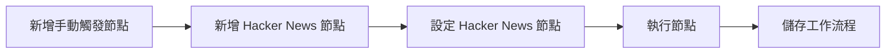
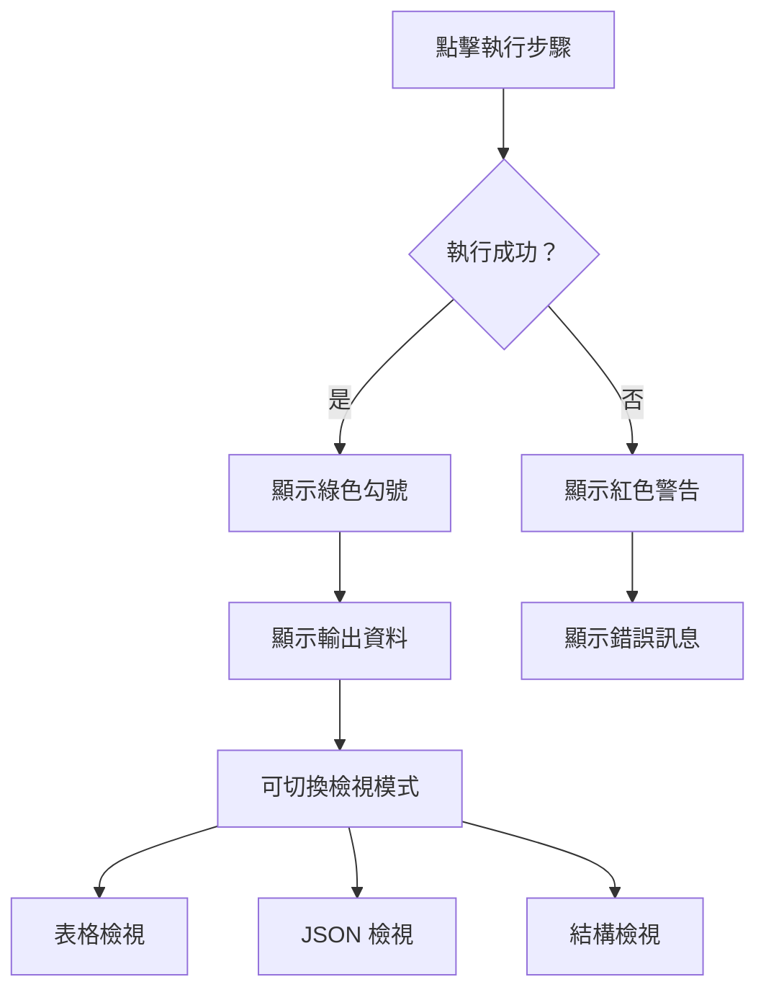

---
#https://www.notion.so/n8n/Frontmatter-432c2b8dff1f43d4b1c8d20075510fe4
contentType: tutorial
---

<!-- vale from-microsoft.We = NO -->
<!-- vale from-microsoft.FirstPerson = NO -->
# 建構迷你工作流程

在本課程中，您將建構一個小型[工作流程](/glossary.md#workflow-n8n)，從 Hacker News 獲取 10 篇關於自動化的文章。該流程包含五個步驟：

1. [新增手動觸發節點](#1-新增手動觸發節點)
2. [新增 Hacker News 節點](#2-新增-hacker-news-節點)
3. [設定 Hacker News 節點](#3-設定-hacker-news-節點)
4. [執行節點](#4-執行節點)
5. [儲存工作流程](#5-儲存工作流程)

完成的工作流程將如下所示：

[[ workflowDemo("file:////courses/level-one/chapter-2.json") ]]

## 1. 新增手動觸發節點

開啟節點面板（提醒：您可以透過選擇[畫布](/glossary.md#canvas-n8n)右上角的**+**圖示或在鍵盤上選擇 ++tab++ 來開啟）。

然後：

1. 搜尋**手動觸發**節點。
2. 當它出現在搜尋中時選擇它。

這將新增[手動觸發](/integrations/builtin/core-nodes/n8n-nodes-base.manualworkflowtrigger.md)節點到您的畫布，它允許您隨時透過選擇**執行工作流程**按鈕來執行工作流程。

/// note | 手動觸發
為了更快速地建立工作流程，您將來可以跳過此步驟。新增任何其他沒有觸發器的節點將自動新增手動觸發節點到工作流程。

在實際情況中，您可能會想要設定排程或其他某種[觸發器](/glossary.md#trigger-node-n8n)來執行工作流程。
///

## 2. 新增 Hacker News 節點

選擇手動觸發節點右側的**+**圖示以開啟節點面板。

然後：

1. 搜尋 **Hacker News** 節點。
2. 當它出現在搜尋中時選擇它。
3. 在**動作**部分，選擇**獲取多個項目**。

n8n 將節點新增到您的畫布，節點視窗開啟以顯示其設定詳細資訊。

## 3. 設定 Hacker News 節點

當您在編輯器 UI 中新增新節點時，節點會自動啟用。節點詳細資訊將在視窗中開啟，其中包含幾個選項：

- **參數**：調整參數以細化和控制節點的功能。
- **設定**：調整設定以控制節點的設計和執行。
- **文件**：在新視窗中開啟此節點的 n8n 文件。

/// note | 參數與設定
* **參數**對於每個節點都不同，取決於其功能。
* **設定**對於所有節點都相同。
///

### 參數

我們需要為 Hacker News 節點設定幾個參數以使其工作：

- **資源**：全部  
此資源選擇所有資料記錄（文章）。
- **操作**：獲取多個  
此操作獲取所有選定的文章。
- **限制**：10  
此參數設定獲取多個操作返回的結果數量限制。
- **附加欄位** > **新增欄位** > **關鍵字**：automation  
**附加欄位**是您可以新增到某些節點的選項，以使您的請求更具體或過濾結果。對於此範例，我們只想獲取包含關鍵字「automation」的文章。  

Hacker News 節點的參數設定現在應該如下所示：

<figure><figcaption align = "center"><i>Hacker News 節點參數</i></figcaption></figure>

### 設定

**設定**部分包含節點設計和執行的幾個選項。在這種情況下，我們只會設定最後兩個設定，它們設定節點在編輯器 UI 畫布中的外觀。

在 Hacker News 節點設定中，編輯：

- **備註**：獲取最新的 10 篇文章。

    /// note | 節點備註
    在節點中新增關於它做什麼的簡短描述通常很有幫助。這對於複雜或共享的工作流程特別有用！
    ///

- **在流程中顯示備註？**：切換為 true 
此選項將在畫布中節點下方顯示備註。

Hacker News 節點的設定配置現在應該如下所示：

<figure><figcaption align = "center"><i>Hacker News 節點設定</i></figcaption></figure>

/// note | 重新命名節點
您可以使用更適合您用例的描述性名稱重新命名節點。有三種方法可以做到這一點：

- 選擇要重新命名的節點，同時按鍵盤上的 F2 鍵。
- 雙擊節點以開啟節點視窗。點擊視窗左上角的節點名稱，按您的喜好重新命名它，然後點擊**重新命名**以新名稱儲存節點。
- 右鍵點擊節點並選擇**重新命名**選項。

<figure><figcaption align = "center"><i>從鍵盤重新命名節點</i></figcaption></figure>

要尋找原始節點名稱（節點類型），開啟節點視窗並選擇**設定**。頁面底部包含節點類型和版本。
///

## 4. 執行節點

在節點詳細資訊視窗中選擇**執行步驟**按鈕。您應該在輸出**表格**檢視中看到 10 個結果。

<!--This screenshot needs updating now that the button says "Execute step" rather than "Test node"-->
<figure><figcaption align = "center"><i>Hacker News 節點的表格檢視結果</i></figcaption></figure>

### 節點執行

/// note | 節點執行
節點執行代表執行該節點以檢索或處理指定資料。
///

如果節點成功執行，畫布中的節點頂部會出現一個小綠色勾號

<figure><figcaption align = "center"><i>成功執行的工作流程</i></figcaption></figure>

如果參數沒有問題且一切正常，請求的資料會以**表格**、**JSON** 和**結構**格式顯示在節點視窗中。您可以透過從節點視窗頂部的**表格 | JSON | 結構**按鈕中選擇您想要的檢視來在這些檢視之間切換。

/// note | 表格與 JSON 檢視
**表格**檢視是預設的。它以表格形式顯示請求的資料，其中行是記錄，列是這些記錄的可用屬性。
///

這是我們的 Hacker News 輸出的 JSON 檢視：

<figure><figcaption align = "center"><i>Hacker News 節點的 JSON 檢視結果</i></figcaption></figure>

節點視窗顯示有關節點執行的更多資訊：

- 在**輸出**標題旁邊，注意一個小圖示（如果節點執行成功，這將是一個綠色勾號）。在它旁邊，有一個資訊圖示。如果您將滑鼠懸停在它上面，您將獲得另外兩項資訊，可以深入了解工作流程中每個單獨節點的性能：
    - **開始時間**：節點執行開始的時間。
    - **執行時間**：從節點開始執行的那一刻起，返回結果所需的時間。
- 就在**輸出**標題下方，您會注意到另一項資訊：**10 個項目**。此欄位顯示節點請求返回的項目（記錄）數量。在此範例中，預期為 10，因為這是我們在步驟 2 中設定的限制。但如果您不設定限制，看到實際返回多少記錄是很有用的。

/// warning | 節點中的錯誤
節點上的紅色警告圖示表示節點有錯誤。如果節點憑證缺失或不正確，或者節點參數未正確設定，可能會發生這種情況。
///
<figure style="text-align:center;"><figcaption align = "center"><i>節點中的錯誤</i></figcaption></figure>

## 5. 儲存工作流程

完成編輯節點後，選擇**返回畫布**以返回主畫布。

預設情況下，您的工作流程會自動儲存為「我的工作流程」。

對於本課程，將工作流程重新命名為「Hacker News 工作流程」。

/// note | 提醒
您可以透過點擊編輯器 UI 頂部的工作流程名稱來重新命名工作流程。
///

重新命名工作流程後，請務必儲存它。

有兩種方式可以儲存工作流程：

- 從編輯器 UI 的畫布中，在鍵盤上點擊 **Ctrl + S** 或 **Cmd + S**。
- 選擇編輯器 UI 右上角的**儲存**按鈕。您可能需要先透過點擊對話框外部來離開節點編輯器。

如果您看到灰色的**已儲存**文字而不是**儲存**按鈕，則您的工作流程已自動儲存。

## 總結

恭喜，您剛剛建構了您的第一個工作流程！在本課程中，您學習了如何在應用程式節點中使用動作、設定它們的參數和設定，以及儲存和執行您的工作流程。

在下一課中，您將遇見您的新客戶 Nathan，他需要自動化他的銷售報告工作。您將為他的用例建構一個更複雜的工作流程，幫助他在工作中變得更有生產力。