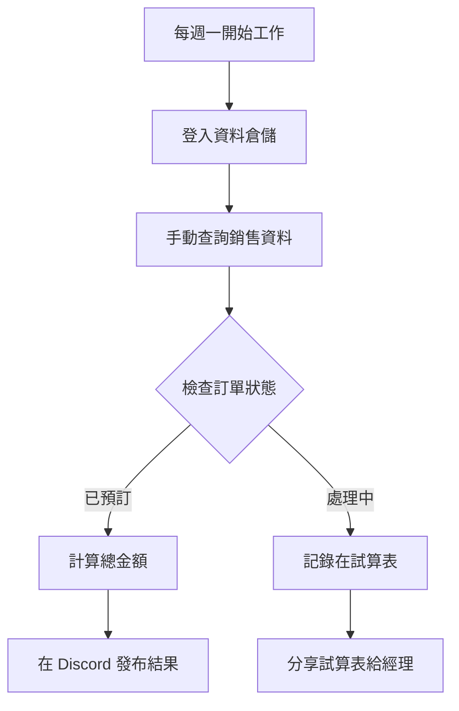
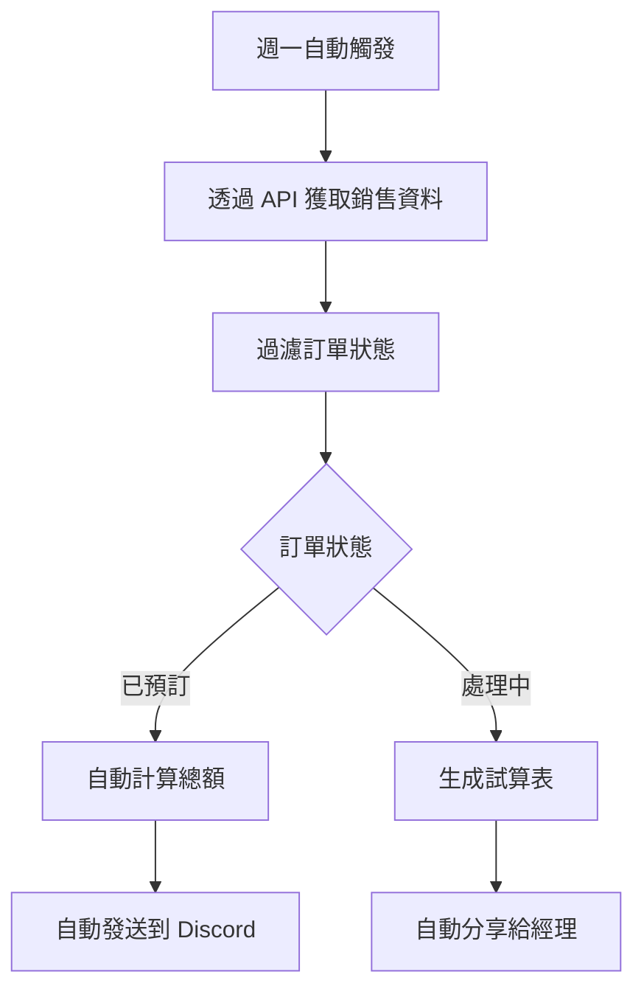

---
#https://www.notion.so/n8n/Frontmatter-432c2b8dff1f43d4b1c8d20075510fe4
contentType: tutorial
---

<!-- vale off -->
# 自動化（真實世界）用例

認識 Nathan 🙋。Nathan 在 ABCorp 擔任分析經理。他的工作是支援 ABCorp 團隊進行報告和分析。作為一個真正的萬事通，他還處理幾個雜項計畫。

Nathan 所做的一些事情是重複且令人麻木的。他想要自動化其中一些任務，這樣他就不會精疲力竭。作為一名**自動化專家**，您今天與 Nathan 會面，幫助他了解如何將他的一些職責轉移給 n8n。

## 了解情境

**您 👩‍🔧：** 很高興認識您，Nathan。很高興能做這件事！有什麼重複性的任務容易出錯，您想先從您的待辦事項中移除？

**Nathan 🙋：** 感謝您的到來！最煩人的一定是每週銷售報告。

我必須從我們的舊版資料倉儲收集銷售資料，該倉儲管理組織主要業務流程的資料，例如銷售或生產。現在，每個銷售訂單可以有「處理中」或「已預訂」狀態。我必須計算所有已預訂訂單的總和，並在每週一在公司 Discord 中公布它們。然後我必須建立所有處理中銷售的試算表，以便銷售經理可以檢視它們並檢查是否需要跟進客戶。

這項手動工作很艱難，需要高度關注細節以確保所有數字都正確。不可避免地，我會失去注意力並輸入錯誤的數字，或者我無法按時完成。我的經理曾經因為我計算錯誤資料而批評過我。

**您 👩‍🔧：** 哦不！資料倉儲沒有匯出資料的方法嗎？

**Nathan 🙋：** 資料倉儲是很久以前內部編寫的。它沒有 CSV 匯出功能，但他們最近新增了幾個 API 端點來公開這些資料，如果這有幫助的話。

**您 👩‍🔧：** 太好了！這是一個很好的開始。如果您有一個通用 API，我們可以新增一些自定義程式碼和幾個服務來製作自動化工作流程。這個任務簡直就是為 n8n 量身定做的。讓我們開始吧！

## Nathan 的工作流程

讓我們來分析一下 Nathan 目前的手動流程和我們計劃建立的自動化流程：

### 目前的手動流程

### 自動化後的流程

透過 n8n 自動化，Nathan 可以：
- 節省每週數小時的手動工作
- 減少人為錯誤
- 確保報告準時完成
- 專注於更有價值的分析工作