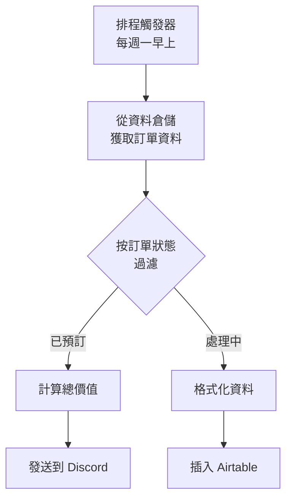
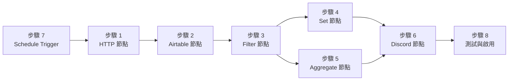

---
#https://www.notion.so/n8n/Frontmatter-432c2b8dff1f43d4b1c8d20075510fe4
contentType: tutorial
---

<!-- vale from-microsoft.We = NO -->
<!-- vale from-microsoft.FirstPerson = NO -->
# 設計工作流程

現在我們知道 Nathan 想要自動化什麼，讓我們考慮他需要採取的步驟來實現他的目標：

1. 從資料倉儲獲取相關資料（訂單 ID、訂單狀態、訂單價值、員工姓名）
2. 按狀態（處理中或已預訂）過濾訂單
3. 計算所有已預訂訂單的總價值
4. 在公司的 Discord 頻道中通知團隊成員有關已預訂訂單
5. 將處理中訂單的詳細資訊插入 Airtable 以供後續跟進
6. 安排此工作流程在每個星期一早上執行

Nathan 的工作流程涉及將資料從公司的資料倉儲傳送到兩個外部服務：

- Discord
- Airtable

在此之前，必須使用一般功能（條件過濾、計算、排程）來處理資料。

n8n 為所有這些步驟提供整合，因此 Nathan 在 n8n 中的工作流程將如下所示：

[[ workflowDemo("file:////courses/level-one/finished.json") ]]

您將分八個步驟建構此工作流程：

1. [從資料倉儲獲取資料](/courses/level-one/chapter-5/chapter-5.1.md)
2. [將資料插入 Airtable](/courses/level-one/chapter-5/chapter-5.2.md)
3. [過濾訂單](/courses/level-one/chapter-5/chapter-5.3.md)
4. [為處理中訂單設定值](/courses/level-one/chapter-5/chapter-5.4.md)
5. [計算已預訂訂單](/courses/level-one/chapter-5/chapter-5.5.md)
6. [通知團隊](/courses/level-one/chapter-5/chapter-5.6.md)
7. [排程工作流程](/courses/level-one/chapter-5/chapter-5.7.md)
8. [啟用和檢查工作流程](/courses/level-one/chapter-5/chapter-5.8.md)

要建構此工作流程，您將需要在註冊本課程時從 n8n 收到的電子郵件中找到的憑證。如果您尚未註冊，可以在[這裡](https://n8n-community.typeform.com/to/PDEMrevI?typeform-source=127.0.0.1){:target="_blank" .external-link}註冊。如果您在註冊後沒有收到確認電子郵件，請[聯絡我們](mailto:help@n8n.io)。

[開始建構！](/courses/level-one/chapter-5/chapter-5.1.md){ .md-button }