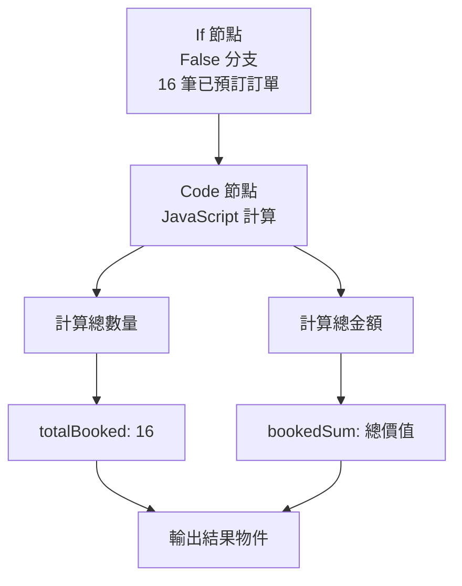
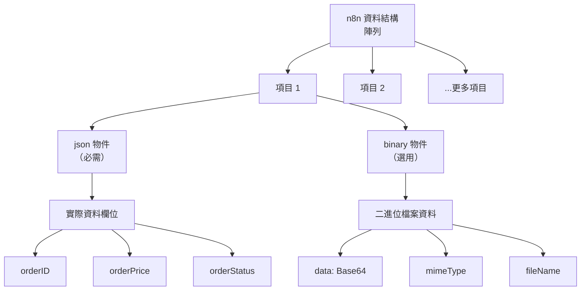

---
#https://www.notion.so/n8n/Frontmatter-432c2b8dff1f43d4b1c8d20075510fe4
contentType: tutorial
---

<!-- vale from-microsoft.We = NO -->
<!-- vale from-microsoft.FirstPerson = NO -->
# 5. 計算已預訂訂單

在工作流程的這個步驟中，您將學習 n8n 如何結構化資料以及如何使用 Code 節點新增自定義 JavaScript 程式碼來執行計算。完成此步驟後，您的工作流程應該如下所示：

[[ workflowDemo("file:////courses/level-one/chapter-5/chapter-5.5.json") ]]

Nathan 工作流程的下一步是從已預訂訂單計算兩個值：

- 已預訂訂單的總數
- 所有已預訂訂單的總價值

要計算資料並為您的工作流程新增更多功能，您可以使用 Code 節點，它讓您可以編寫自定義 JavaScript 程式碼。



## 關於 Code 節點

/// warning | Code 節點模式
Code 節點有兩種操作**模式**，取決於您想要如何處理項目：

* **為所有項目執行一次**允許您編寫程式碼一次處理所有輸入項目，作為一個群組。
* **為每個項目執行一次**為每個輸入項目執行一次您的程式碼。

了解更多關於如何使用 [Code 節點](/integrations/builtin/core-nodes/n8n-nodes-base.code/index.md)。
///

在 n8n 中，節點之間傳遞的資料是具有以下 JSON 結構的物件陣列：

```json
[
    {
   	 "json": { // (1)!
   		 "apple": "beets",
   		 "carrot": {
   			 "dill": 1
   		 }
   	 },
   	 "binary": { // (2)!
   		 "apple-picture": { // (3)!
   			 "data": "....", // (4)!
   			 "mimeType": "image/png", // (5)!
   			 "fileExtension": "png", // (6)!
   			 "fileName": "example.png", // (7)!
   		 }
   	 }
    },
    ...
]
```

1. （必需）n8n 將實際資料儲存在巢狀的 `json` 鍵中。此屬性是必需的，但可以設定為從空物件（如 `{}`）到陣列和深層巢狀資料的任何內容。如果缺少，Code 節點會自動將資料包裝在 `json` 物件和父陣列（`[]`）中。
2. （選用）項目的二進位資料。n8n 中的大多數項目不包含二進位資料。
3. （必需）二進位資料的任意鍵名。
4. （必需）Base64 編碼的二進位資料。
5. （選用）如果可能應該設定。
6. （選用）如果可能應該設定。
7. （選用）如果可能應該設定。

### n8n 資料結構概覽



您可以在 [n8n 資料結構](/data/data-structure.md)頁面上了解更多關於預期格式的資訊。

## 設定 Code 節點

現在讓我們看看如何使用 Code 節點完成 Nathan 的任務。

在您的工作流程中，新增連接到 **If 節點**的 `false` 分支的 **Code 節點**。

開啟 Code 節點視窗後，設定這些參數：

- **模式**：選擇**為所有項目執行一次**。
- **語言**：選擇 **JavaScript**。

	/// note | 在 Code 節點中使用 Python
	雖然我們下面使用 JavaScript，但您也可以在 Code 節點中使用 Python。要了解更多，請參考 [Code 節點](/code/code-node.md)文件。
	///
	
- 複製下面的程式碼並貼上到**程式碼**框中以替換現有程式碼：

	```javascript
	let items = $input.all();
	let totalBooked = items.length;
	let bookedSum = 0;

	for (let i=0; i < items.length; i++) {
	  bookedSum = bookedSum + items[i].json.orderPrice;
	}

	return [{ json: {totalBooked, bookedSum} }];
	```

注意我們返回計算結果的格式：

```javascript
return [{ json: {totalBooked, bookedSum} }]
```

/// warning | 資料結構錯誤
如果您不使用正確的資料結構，您將收到錯誤訊息：`Error: Always an Array of items has to be returned!`
///

現在選擇**執行步驟**，您應該看到以下結果：

<figure><figcaption align = "center"><i>Code 節點輸出</i></figcaption></figure>

## 接下來是什麼？

**Nathan 🙋**：哇，Code 節點很強大！這意味著如果我有一些基本的 JavaScript 技能，我可以增強我的工作流程。

**您 👩‍🔧**：是的！您可以從無程式碼進步到低程式碼！

**Nathan 🙋**：現在，我如何將已預訂訂單的計算結果傳送到我團隊的 Discord 頻道？

**您 👩‍🔧**：有一個 n8n 節點可以做到這一點。我會在下一步中設定它。