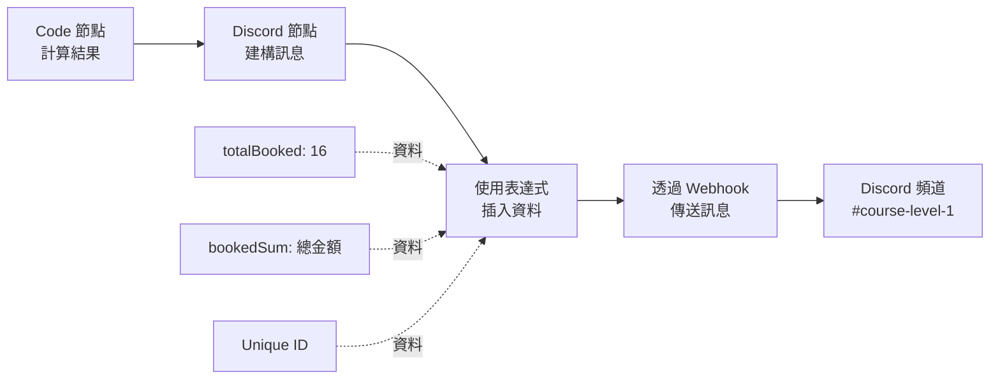
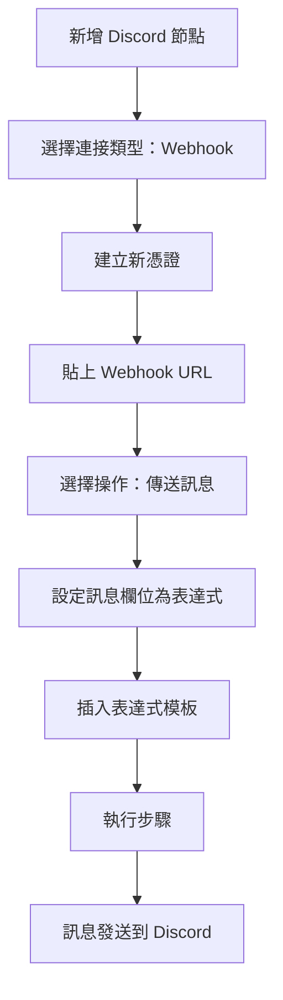

---
#https://www.notion.so/n8n/Frontmatter-432c2b8dff1f43d4b1c8d20075510fe4
contentType: tutorial
---

<!-- vale from-microsoft.We = NO -->
<!-- vale from-microsoft.FirstPerson = NO -->
# 6. 通知團隊

在工作流程的這個步驟中，您將學習如何使用 [Discord 節點](/integrations/builtin/app-nodes/n8n-nodes-base.discord/index.md)向 Discord 頻道傳送訊息。完成此步驟後，您的工作流程應該如下所示：

[[ workflowDemo("file:////courses/level-one/chapter-5/chapter-5.6.json") ]]

現在您已經計算出已預訂訂單的摘要，您需要在他們的 Discord 頻道中通知 Nathan 的團隊。對於此工作流程，您將向 Discord 上的 [n8n 伺服器](https://discord.gg/G98WXzsjky)傳送訊息。

在開始以下步驟之前，請使用上面的連結連接到 Discord 上的 n8n 伺服器。確保您可以存取 `#course-level-1` 頻道。



/// note | 通訊應用程式節點
您可以用另一個通訊應用程式替換 Discord 節點。例如，n8n 也有 [Slack](/integrations/builtin/app-nodes/n8n-nodes-base.slack.md) 和 [Mattermost](/integrations/builtin/app-nodes/n8n-nodes-base.mattermost.md) 的節點。
///

在您的工作流程中，新增連接到 Code 節點的 Discord 節點。

當您搜尋 Discord 節點時，尋找**訊息動作**並選擇**傳送訊息**以新增節點。

在 Discord 節點視窗中，設定這些參數：

- **連接類型**：選擇 **Webhook**。
- **Discord Webhook 的憑證**：選擇**- 建立新憑證 -**。
    - 從您註冊本課程時收到的電子郵件中複製 **Webhook URL**，並將其貼上到憑證的 **Webhook URL** 欄位中。
    - 選擇**儲存**，然後關閉憑證對話框。
- **操作**：選擇**傳送訊息**。
- **訊息**：
    - 選擇訊息欄位右側的**表達式**標籤。
    - 複製下面的文字並貼上到**表達式**視窗中，或使用**表達式編輯器**手動建構它。
		```
		This week we've {{$json["totalBooked"]}} booked orders with a total value of {{$json["bookedSum"]}}. My Unique ID: {{ $('HTTP Request').params["headerParameters"]["parameters"][0]["value"] }}
		```

### Discord 節點設定步驟



現在在 Discord 節點中選擇**執行步驟**。如果一切正常，您應該在 n8n 中看到此輸出：

<figure><figcaption align = "center"><i>Discord 節點輸出</i></figcaption></figure>

您的訊息應該出現在 Discord 頻道 #course-level-1 中：

<figure><figcaption align = "center"><i>Discord 訊息</i></figcaption></figure>

## 接下來是什麼？

**Nathan 🙋**：太不可思議了，您已經為我節省了數小時的繁瑣工作！現在我可以在需要時執行此工作流程。我只需要記住在每個星期一早上 9 點執行它。

**您 👩‍🔧**：別擔心，您實際上可以安排工作流程在特定日期、時間或間隔執行。我會在下一步中設定這個。