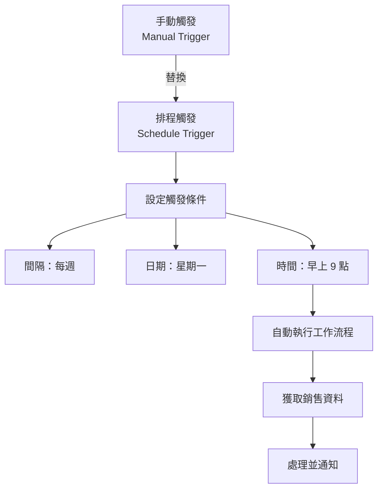
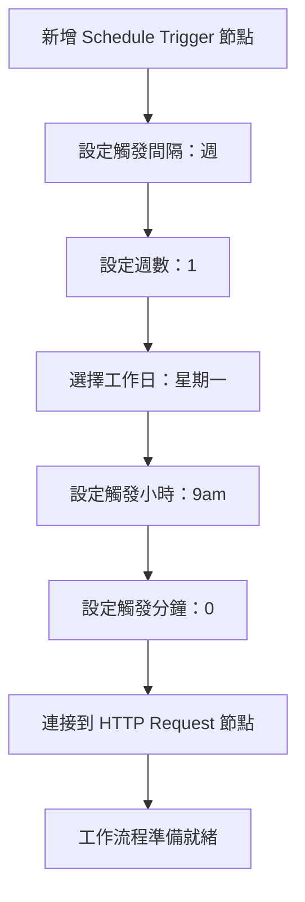

---
#https://www.notion.so/n8n/Frontmatter-432c2b8dff1f43d4b1c8d20075510fe4
contentType: tutorial
---

<!-- vale from-microsoft.We = NO -->
<!-- vale from-microsoft.FirstPerson = NO -->
# 7. 排程工作流程

在工作流程的這個步驟中，您將學習如何使用 Schedule Trigger 節點排程您的工作流程，使其在設定的時間/間隔自動執行。完成此步驟後，您的工作流程應該如下所示：

[[ workflowDemo("file:////courses/level-one/finished.json") ]]

到目前為止，您建構的工作流程只有在您點擊**測試工作流程**時才會執行。但 Nathan 需要它在每個星期一早上自動執行。您可以使用 [Schedule Trigger](/integrations/builtin/core-nodes/n8n-nodes-base.scheduletrigger/index.md) 來做到這一點，它允許您安排工作流程在固定日期、時間或間隔定期執行。

為了實現這一點，我們將移除我們開始時的 Manual Trigger 節點，並用 Schedule Trigger 節點替換它。

## 移除 Manual Trigger 節點

首先，讓我們移除 Manual Trigger 節點：

1. 選擇連接到您的 HTTP Request 節點的 Manual Trigger 節點。
2. 選擇垃圾桶圖示以刪除。

這會移除 Manual Trigger 節點，您會看到「新增第一步」選項。

## 新增 Schedule Trigger 節點

1. 開啟節點面板並搜尋 **Schedule Trigger**。
2. 當它出現在搜尋結果中時選擇它。

在 Schedule Trigger 節點視窗中，設定這些參數：

- **觸發間隔**：選擇**週**。
- **觸發之間的週數**：輸入 `1`。
- **在工作日觸發**：選擇**星期一**（如果預設新增了**星期日**，請移除它）。
- **觸發小時**：選擇 **9am**。
- **觸發分鐘**：輸入 `0`。

### Schedule Trigger 設定流程

您的 Schedule Trigger 節點應該如下所示：

<figure><figcaption align = "center"><i>Schedule Trigger 節點</i></figcaption></figure>

/// warning | 請記住
為了確保 Schedule Trigger 節點的準確排程，請務必為您的 [n8n 實例](/manage-cloud/set-cloud-timezone.md)或[工作流程的設定](/workflows/settings.md)設定正確的時區。如果有設定，Schedule Trigger 節點將使用工作流程的時區；如果沒有，它將回退到 n8n 實例的時區。
///

## 連接 Schedule Trigger 節點

返回畫布並透過從 Schedule Trigger 節點拖曳箭頭到 HTTP Request 節點來連接它們。

您的完整工作流程應該如下所示：

[[ workflowDemo("file:////courses/level-one/finished.json") ]]

## 接下來是什麼？

**您 👩‍🔧**：工作流程就是這樣！我已經新增並設定了所有必要的節點。現在每次您點擊**執行工作流程**時，n8n 都會執行所有節點：獲取、過濾、計算和傳輸銷售資料。

**Nathan 🙋**：這正是我需要的！我的工作流程將在每個星期一早上自動執行，對吧？

**您 👩‍🔧**：別那麼快。要做到這一點，您需要啟用您的工作流程。我會在下一步中執行此操作，並向您展示如何解讀執行日誌。
<!-- vale from-microsoft.We = YES -->