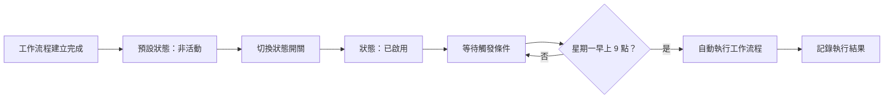
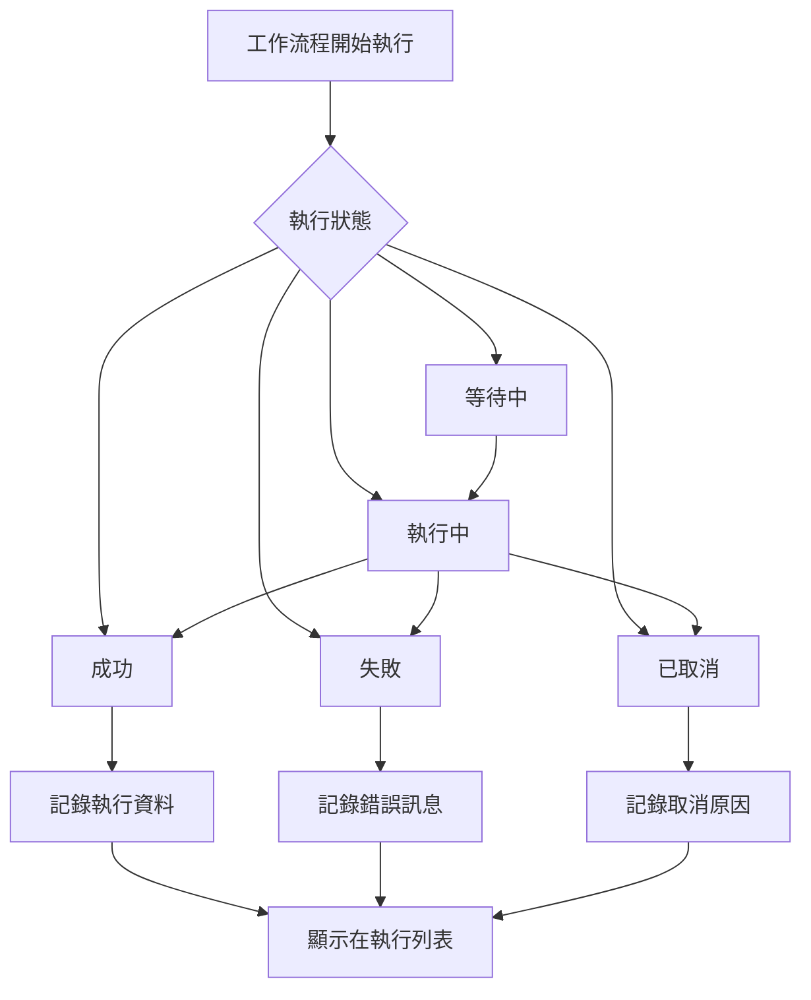

---
#https://www.notion.so/n8n/Frontmatter-432c2b8dff1f43d4b1c8d20075510fe4
contentType: tutorial
---

<!-- vale from-microsoft.We = NO -->
<!-- vale from-microsoft.FirstPerson = NO -->
# 8. 啟用和檢查工作流程

在工作流程的這個步驟中，您將學習如何啟用您的工作流程並更改預設工作流程設定。

啟用工作流程意味著每當觸發節點接收輸入或滿足條件時，它將自動執行。預設情況下，所有新建立的工作流程都是停用的。

要啟用您的工作流程，將編輯器 UI 頂部導覽中的**非活動**切換設為**已啟用**。Nathan 的工作流程現在將在每個星期一上午 9 點自動執行：

<figure><figcaption align = "center"><i>已啟用的工作流程</i></figcaption></figure>

## 工作流程執行

執行代表工作流程從第一個節點到最後一個節點的完整運行。n8n 記錄工作流程執行，讓您可以查看工作流程是否成功。執行日誌對於調試您的工作流程並查看它在哪個階段遇到問題很有用。

要檢視特定工作流程的執行，當工作流程在畫布上開啟時，您可以切換到**執行**標籤。使用**編輯器**標籤切換回節點編輯器。

要查看整個 n8n 實例的執行日誌，在您的編輯器 UI 中，選擇**概覽**，然後在主面板中選擇**執行**標籤。

<figure><figcaption align = "center"><i>執行列表</i></figcaption></figure>

**執行**視窗顯示包含以下資訊的表格：

- **名稱**：工作流程的名稱
- **開始時間**：工作流程開始的日期和時間
- **狀態**：工作流程的狀態（等待中、執行中、成功、已取消或失敗）以及工作流程執行所花費的時間
- **執行 ID**：此工作流程執行的 ID

/// note | 工作流程執行狀態
您可以按工作流程和狀態（**任何狀態**、**失敗**、**已取消**、**執行中**、**成功**或**等待中**）過濾顯示的**執行**。
此處顯示的資訊取決於您在[**工作流程設定**](/workflows/settings.md)中配置要儲存的執行。
///

### 工作流程執行狀態

## 工作流程設定

您可以自定義您的工作流程和執行，或在[**工作流程設定**](/workflows/settings.md)中覆寫一些全域預設設定。

當工作流程在畫布上開啟時，透過選擇編輯器 UI 右上角的三個點，然後選擇**設定**來存取這些設定。

<figure><figcaption align = "center"><i>工作流程設定</i></figcaption></figure>

在**工作流程設定**視窗中，您可以配置以下設定：

- **Execution Order**：為多分支工作流程選擇執行邏輯。如果您沒有依賴舊版執行順序的工作流程，您應該將其保持設定為 `v1`。
- [**Error Workflow**](/flow-logic/error-handling.md)：當前工作流程執行失敗時要執行的工作流程。
- **This workflow can be called by**：允許使用 [Execute Sub-workflow 節點](/integrations/builtin/core-nodes/n8n-nodes-base.executeworkflow.md)呼叫此工作流程的工作流程。
- **Timezone**：在當前工作流程中使用的時區。如果未設定，則使用全域時區。特別是，此設定對於 [Schedule Trigger 節點](/integrations/builtin/core-nodes/n8n-nodes-base.scheduletrigger/index.md)很重要，因為您要確保工作流程在正確的時間執行。
- **Save failed production executions**：當工作流程失敗時，n8n 是否應該儲存工作流程的執行資料。預設是儲存。
- **Save successful production executions**：當工作流程成功時，n8n 是否應該儲存工作流程的執行資料。預設是儲存。
- **Save manual executions**：n8n 是否應該儲存從編輯器 UI 啟動的執行。預設是儲存。
- **Save execution progress**：n8n 是否應該儲存每個節點的執行資料。如果設定為儲存，您可以在發生錯誤時從停止的地方恢復工作流程，但請記住這可能會使執行速度變慢。預設是不儲存。
- **Timeout Workflow**：是否在特定時間段後取消工作流程執行。預設是不超時。

## 接下來是什麼？

**您 👩‍🔧**：就是這樣！現在您有一個 7 節點的工作流程，將在每個星期一早上自動執行。您不必擔心記得處理資料。相反，您可以用更有意義或令人興奮的工作開始您的一週。

**Nathan 🙋**：這個工作流程非常有幫助，謝謝您！那麼，您接下來要做什麼？

**您 👩‍🔧**：我想建構更多工作流程，與他人分享它們，並使用其他人建構的一些工作流程。