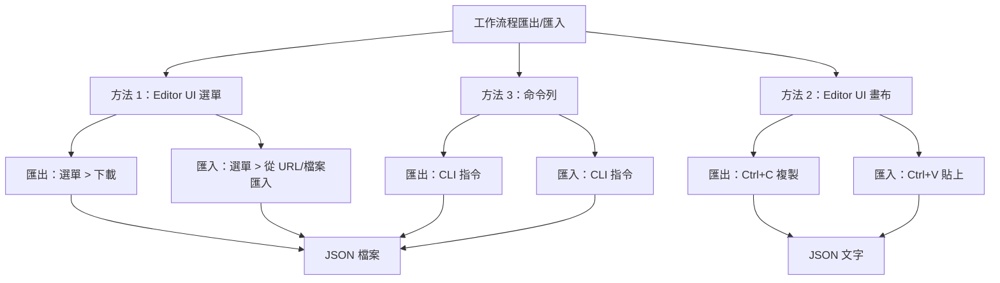

---
#https://www.notion.so/n8n/Frontmatter-432c2b8dff1f43d4b1c8d20075510fe4
contentType: tutorial
---

<!-- vale from-microsoft.We = NO -->
<!-- vale from-microsoft.FirstPerson = NO -->
# 匯出和匯入工作流程

在本章中，您將學習如何匯出和匯入工作流程。

## 匯出和匯入工作流程

您可以將 n8n 工作流程以 JSON 檔案的形式儲存在本地。如果您想與他人分享您的工作流程或從他人匯入工作流程，這很有用。

--8<-- "_snippets/workflows/sharing-credentials.md"

<figure><figcaption align = "center"><i>匯入和匯出工作流程選單</i></figcaption></figure>

您可以透過三種方式匯出和匯入工作流程：

* 從 **Editor UI** 選單：
    * 匯出：從頂部導覽列，選擇右上角的三個點，然後選擇**下載**。這將把您當前的工作流程作為 JSON 檔案下載到您的電腦上。
    * 匯入：從頂部導覽列，選擇右上角的三個點，然後選擇**從 URL 匯入**（匯入已發布的工作流程）或**從檔案匯入**（以 JSON 檔案形式匯入工作流程）。
* 從 **Editor UI** 畫布：
	* 匯出：選擇畫布上的所有節點並使用 ++ctrl+c++ 複製工作流程 JSON。您可以將其貼上到檔案中或直接與其他人分享。
	* 匯入：您可以使用 ++ctrl+v++ 直接將複製的工作流程 JSON 貼上到畫布中。
* 從命令列：
    * 匯出：請參閱匯出工作流程或憑證的[完整命令列表](/hosting/cli-commands.md)。
    * 匯入：請參閱匯入工作流程或憑證的[完整命令列表](/hosting/cli-commands.md#import-workflows-and-credentials)。