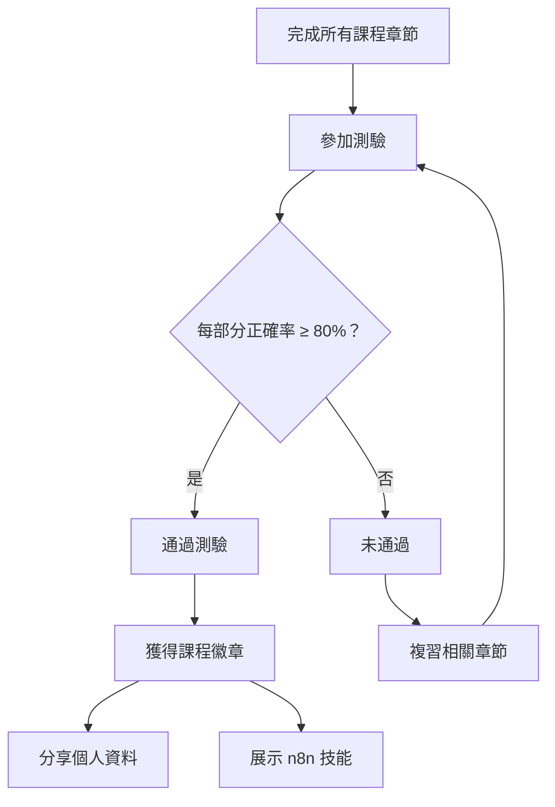
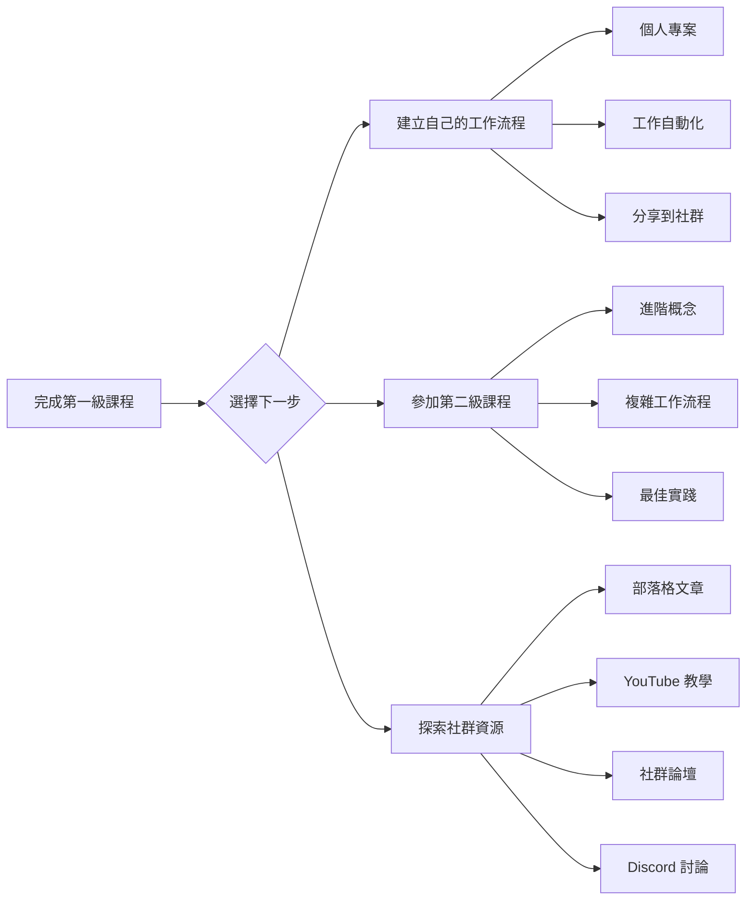

---
#https://www.notion.so/n8n/Frontmatter-432c2b8dff1f43d4b1c8d20075510fe4
contentType: tutorial
---

<!-- vale from-microsoft.We = NO -->
<!-- vale from-microsoft.FirstPerson = NO -->
# 測試您的知識

恭喜，您完成了 n8n 第一級課程！

您已經學到了很多關於工作流程自動化的知識，並建構了您的第一個業務工作流程。為什麼不展示您的技能呢？

您可以透過參加**測驗**來測試您的知識，測驗包含關於本課程涵蓋的理論概念和工作流程的問題。

- 您需要在每個部分至少有 80% 的正確答案才能通過測驗。
- 您可以多次參加測驗。
- 回答測驗問題沒有時間限制。

### 測驗評估流程

 
[參加測驗！](https://n8n-community.typeform.com/to/JMoBXeGA){ .md-button }

## 接下來是什麼？

### 學習路徑建議

* 為您的工作或個人用途建立新的工作流程並與我們分享。沒有任何想法嗎？在我們的[部落格](https://n8n.io/blog/)、[YouTube 頻道](https://www.youtube.com/c/n8n-io)、[社群論壇](https://community.n8n.io)和 [Discord 伺服器](https://discord.gg/vWwMVThRta)上尋找靈感。
* 參加 n8n [第二級課程](/courses/level-two/index.md)。
<!-- vale from-microsoft.We = YES -->