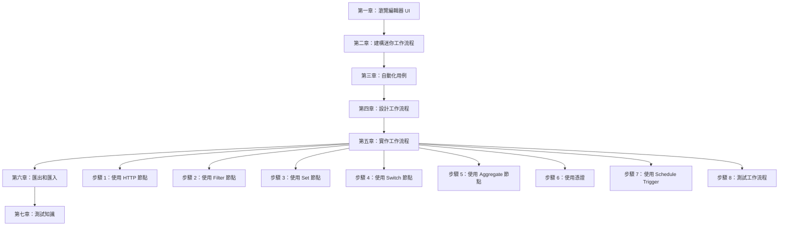
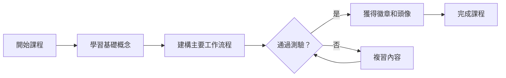

---
#https://www.notion.so/n8n/Frontmatter-432c2b8dff1f43d4b1c8d20075510fe4
contentType: overview
---

<!-- vale from-microsoft.We = NO -->
<!-- vale from-microsoft.FirstPerson = NO -->
# 第一級：簡介

歡迎來到 **n8n 第一級課程**！

## 這個課程適合我嗎？

本課程將向您介紹 n8n 的基本概念，並培養您的低程式碼自動化專業能力。

如果您符合以下條件，這個課程就是為您準備的：

- 第一次開始使用 n8n。
- 正在尋找創建第一個工作流程的額外幫助。
- 想要在個人或工作生活中自動化流程。

本課程介紹 n8n 概念並示範實際的工作流程建構，不假設您對 n8n 有任何先前的熟悉度。如果您想在沒有太多解釋的情況下了解基礎知識，請參考我們的[快速入門指南](/try-it-out/tutorial-first-workflow.md)。

## 我會在這個課程中學到什麼？

我們相信透過實作來學習。您可以期待一些關於 n8n 基本概念和元件的理論資訊，然後逐步練習建構工作流程。

在課程結束時，您將會知道：

- 如何設定 n8n 並導航編輯器 UI。
- n8n 如何結構化資料。
- 如何設定不同的節點參數並新增憑證。
- 何時以及如何在工作流程中使用條件邏輯。
- 如何排程和控制工作流程。
- 如何匯入、下載並與他人分享工作流程。

您將建立兩個工作流程：

- 一個兩節點的工作流程，從 Hacker News 獲取文章
- 一個七節點的工作流程，幫助您的客戶從資料倉儲獲取記錄、過濾它們、進行計算，並通知團隊成員有關結果

### 課程架構總覽

## 開始前我需要什麼？

1. **n8n 設定**：您可以使用 [n8n Cloud](/manage-cloud/overview.md)（或者如果您有託管服務的經驗，可以使用[自託管版本](/hosting/installation/docker.md)）。
2. **課程使用者 ID**：[在此註冊](https://n8n-community.typeform.com/to/PDEMrevI)以獲得您的唯一 ID 和課程中需要的其他憑證。
3. JavaScript 和 [API](https://blog.n8n.io/what-are-apis-how-to-use-them-with-no-code/) 的基本知識會有幫助，但不是必需的。
4. 如果您希望在成功完成後獲得個人資料徽章和頭像，需要一個 [n8n 社群論壇帳號](https://community.n8n.io/)。

## 課程需要多長時間？

完成課程應該需要大約**兩個小時**。您不必一次完成；隨時可以休息並在準備好時繼續。

## 我如何完成課程？

本課程中有兩個里程碑來測試您對所學內容的理解：

- [x] 建構[主要工作流程](/courses/level-one/chapter-5/chapter-5.1.md)
- [x] 在課程結束時通過[測驗](https://n8n-community.typeform.com/to/JMoBXeGA)

/// note | 檢查您的進度
您可以隨時在整個課程中透過在[這裡](https://internal.users.n8n.cloud/webhook/course-level-1/verify)輸入您的唯一 ID 來**檢查您的進度**。
///

如果您完成了上述里程碑，您將在論壇個人資料中獲得[**徽章和頭像**](https://community.n8n.io/badges/104/completed-n8n-course-level-1)。然後您可以分享您的個人資料和課程驗證 ID，向他人展示您的 n8n 技能。

[讓我們開始吧！](/courses/level-one/chapter-1.md){ .md-button }