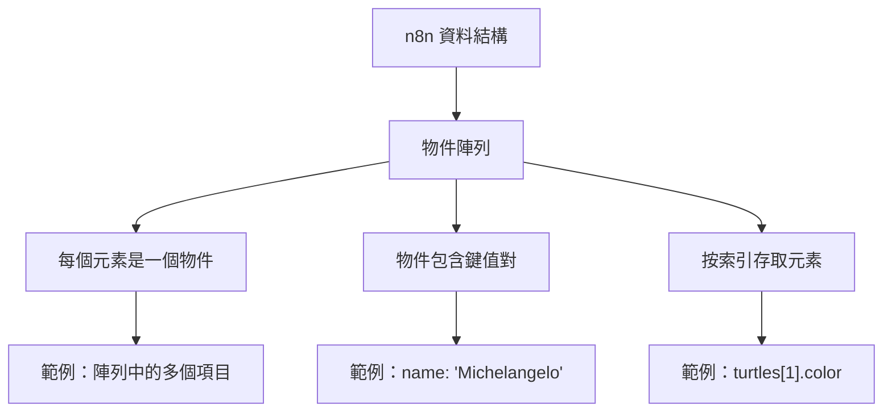
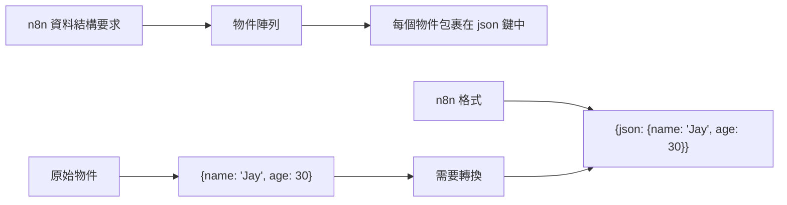
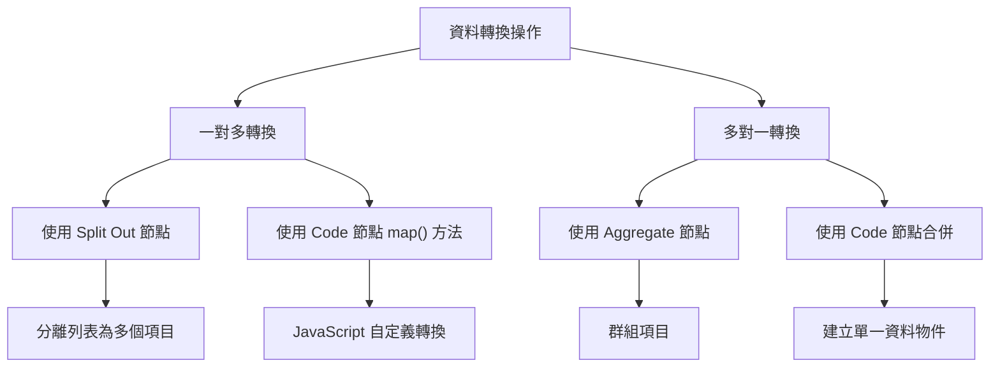

---
#https://www.notion.so/n8n/Frontmatter-432c2b8dff1f43d4b1c8d20075510fe4
contentType: tutorial
---

# 了解資料結構

在本章中，您將學習 n8n 的資料結構以及如何使用 [Code 節點](/integrations/builtin/core-nodes/n8n-nodes-base.code/index.md){:target="_blank"} 來轉換資料和模擬節點輸出。

## n8n 的資料結構

從基本意義上說，n8n 節點的功能就像一個擷取、轉換、載入（ETL）工具。節點允許您從多個不同的來源存取（擷取）資料，以特定方式修改（轉換）該資料，並將其傳遞（載入）到需要的地方。

在您的工作流程中從一個節點移動到另一個節點的資料必須採用每個節點都能識別和解釋的格式（結構）。在 n8n 中，這個必要的結構是物件陣列。



/// note | 關於物件陣列
陣列是一個值的列表。陣列可以是空的或包含多個元素。每個元素都儲存在列表中的一個位置（索引）上，從 0 開始，可以通過索引號來引用。例如，在陣列 `["Leonardo", "Michelangelo", "Donatello", "Raphael"];` 中，元素 `Donatello` 儲存在索引 2。

物件儲存鍵值對，而不是像陣列那樣在編號索引處儲存值。鍵值對的順序並不重要，因為可以通過引用鍵名來存取值。例如，下面的物件包含兩個屬性（`name` 和 `color`）：

```json
{
	name: 'Michelangelo',
	color: 'blue',
}
```

物件陣列是包含一個或多個物件的陣列。例如，下面的陣列 `turtles` 包含四個物件：

```javascript
var turtles = [
	{
		name: 'Michelangelo',
		color: 'orange',
	},
	{
		name: 'Donatello',
		color: 'purple',
	},
	{
		name: 'Raphael',
		color: 'red',
	},
	{
		name: 'Leonardo',
		color: 'blue',
	}
];
```

您可以使用點表示法通過語法 `object.property` 來存取物件的屬性。例如，`turtles[1].color` 獲取第二隻海龜的顏色。
///

從一個節點發送到另一個節點的資料以 JSON 物件陣列的形式發送。此集合中的元素稱為項目（items）。

<figure><figcaption align = "center"><i>項目</i></figcaption></figure>

n8n 節點對傳入資料的每個項目執行其操作。

<figure><figcaption align = "center"><i>客戶資料儲存節點中的項目</i></figcaption></figure>

## 使用 Code 節點建立資料集

現在您已經熟悉了 n8n 資料結構，您可以使用它來建立自己的資料集或模擬節點輸出。為此，使用 [Code 節點](/integrations/builtin/core-nodes/n8n-nodes-base.code/index.md){:target="_blank"} 編寫 JavaScript 程式碼，定義具有以下結構的物件陣列：

```javascript
return [
	{
		json: {
			apple: 'beets',
		}
	}
];
```

例如，在 Code 節點中表示忍者龜的物件陣列會像這樣：

<figure><figcaption align = "center"><i>Code 節點中的物件陣列</i></figcaption></figure>



/// warning | JSON 物件
請注意，這個物件陣列包含一個額外的鍵：`json`。n8n 期望您將陣列中的每個物件包裹在另一個物件中，使用鍵 `json`。

<figure><figcaption align = "center"><i>n8n 中資料結構的說明</i></figcaption></figure>

傳遞符合 n8n 使用的正確結構的資料是一個好習慣。但如果您忘記將 `json` 鍵添加到項目中也不用擔心，n8n（0.166.0 及以上版本）會自動添加它。
///

您也可以有巢狀的鍵值對，例如如果您想定義主要和次要顏色。在這種情況下，您需要使用大括號 `{}` 進一步包裹鍵值對。

/// note | n8n 資料結構影片
[這個演講](https://www.youtube.com/watch?v=mQHT3Unn4tY)提供了關於 n8n 資料結構的更詳細說明。

<iframe width="560" height="315" src="https://www.youtube.com/embed/mQHT3Unn4tY" title="YouTube video player" frameborder="0" allow="accelerometer; autoplay; clipboard-write; encrypted-media; gyroscope; picture-in-picture" allowfullscreen></iframe>
///

### 練習

在 Code 節點中，建立一個名為 `myContacts` 的物件陣列，包含 `name` 和 `email` 屬性，`email` 屬性進一步分為 `personal` 和 `work`。

??? note "顯示解答"

	在 **Code 節點**的 JavaScript Code 欄位中，您需要編寫以下程式碼：

	```javascript
	var myContacts = [
		{
			json: {
				name: 'Alice',
				email: {
					personal: 'alice@home.com',
					work: 'alice@wonderland.org'
				},
			}
		},
		{
			json: {
				name: 'Bob',
				email: {
					personal: 'bob@mail.com',
					work: 'contact@thebuilder.com'
					},
			}
		},
	];

	return myContacts;
	```

	當您執行 **Code 節點**時，結果應該如下所示：

	<figure><figcaption align = "center"><i>Code 節點的結果</i></figcaption></figure>

## 使用 Code 節點引用節點資料

就像您可以使用[表達式](/code/expressions.md)來引用其他節點的資料一樣，您也可以在 **Code 節點**中使用一些[方法和變數](/code/builtin/overview.md)。

請確保在繼續下一個練習之前閱讀這些頁面。

### 練習

讓我們基於前一個練習進行擴展，在該練習中您使用 Code 節點建立了兩個聯絡人及其姓名和電子郵件的資料集。現在，將第二個 Code 節點連接到第一個節點。在新節點中，編寫程式碼建立一個名為 `workEmail` 的新欄位，引用第一個聯絡人的工作電子郵件。

??? note "顯示解答"
	在 **Code 節點**的 JavaScript Code 欄位中，您需要編寫以下程式碼：

	```javascript
	let items = $input.all();
	items[0].json.workEmail = items[0].json.email['work'];
	return items;
	```

	當您執行 **Code 節點**時，結果應該如下所示：

	<figure><figcaption align = "center"><i>Code 節點引用</i></figcaption></figure>

## 轉換資料

來自某些節點的傳入資料可能具有與 n8n 中使用的不同的資料結構。在這種情況下，您需要[轉換資料](/data/transforming-data.md){:target="_blank" .external}，以便每個項目可以單獨處理。

資料轉換的兩個最常見操作是：

- 從一個項目建立多個項目
- 從多個項目建立單一項目



有幾種方法可以為上述目的轉換資料：

- 使用 n8n 的[資料轉換節點](/data/index.md#data-transformation-nodes)。使用這些節點來修改包含列表（陣列）的傳入資料結構，而無需在 **Code 節點**中使用 JavaScript 程式碼：
	- 使用 [**Split Out 節點**](/integrations/builtin/core-nodes/n8n-nodes-base.splitout.md)將包含列表的單一資料項目分離為多個項目。
	- 使用 [**Aggregate 節點**](/integrations/builtin/core-nodes/n8n-nodes-base.aggregate.md)取得單獨的項目或其部分，並將它們組合成單獨的項目。
- 使用 **Code 節點**編寫 JavaScript 函數，使用**為所有項目執行一次**模式來修改傳入資料的資料結構：
    - 要從單一項目建立多個項目，您可以使用像這樣的 JavaScript 程式碼。此範例假設項目有一個名為 `data` 的鍵，設定為項目陣列，格式為：`[{ "data": [{<item_1>}, {<item_2>}, ...] }]`：
	```javascript
	return $input.first().json.data.map(item => {
        return {
            json: item
        }
    });
	```
	- 要從多個項目建立單一項目，您可以使用此 JavaScript 程式碼：
	```javascript
    return [
    	{
        	json: {
        		data_object: $input.all().map(item => item.json)
        	}
        }
      ];
	```

這些 JavaScript 範例假設您的整個輸入就是您想要轉換的內容。如上面的練習所示，您也可以通過在項目列表中識別特定欄位來對其執行任一操作，例如，如果我們的 workEmail 範例在單一欄位中有多個電子郵件，我們可以執行這樣的程式碼：
```javascript
let items = $input.all();
return items[0].json.workEmail.map(item => {
	return {
		json: item
	}
});
```

### 練習

1. 使用 **HTTP Request 節點**向 PokéAPI `https://pokeapi.co/api/v2/pokemon` 發出 GET 請求。（此 API 不需要認證）。
2. 使用 **Split Out 節點**轉換 `results` 欄位中的資料。
3. 使用 **Code 節點**轉換 `results` 欄位中的資料。

??? note "顯示解答"

	1. 要從 PokéAPI 獲取寶可夢，使用以下參數執行 **HTTP Request 節點**：
		- **Authentication**：None
		- **Request Method**：GET
		- **URL**：https://pokeapi.co/api/v2/pokemon
	2. 要使用 **Split Out 節點**轉換資料，將此節點連接到 **HTTP Request 節點**並設定以下參數：
		- **Field To Split Out**：results
		- **Include**：No Other Fields
	3. 要使用 **Code 節點**轉換資料，將此節點連接到 **HTTP Request 節點**並在 JavaScript Code 欄位中編寫以下程式碼：
		```javascript
		let items = $input.all();
		return items[0].json.results.map(item => {
			return {
				json: item
			}
		});
		```