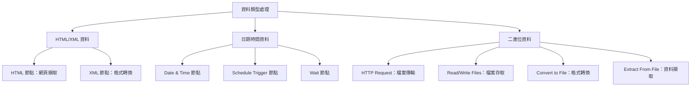
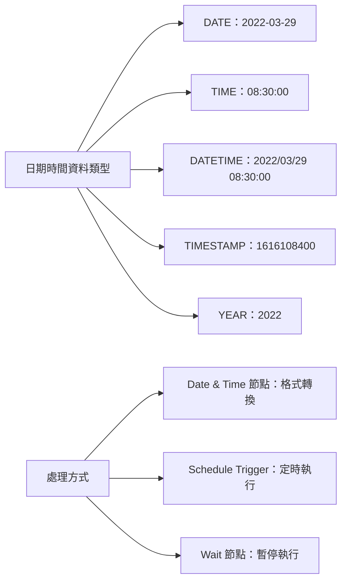
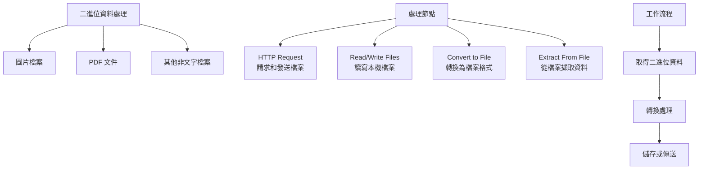

---
#https://www.notion.so/n8n/Frontmatter-432c2b8dff1f43d4b1c8d20075510fe4
contentType: tutorial
---

# 處理不同資料類型

在本章中，您將學習如何使用 [n8n 核心節點](/workflows/components/nodes.md)處理不同類型的資料。



## HTML 和 XML 資料

您很可能熟悉 HTML 和 XML。

/// note | HTML vs. XML
HTML 是一種用於描述網頁結構和語義的標記語言。XML 看起來類似於 HTML，但標籤名稱不同，因為它們描述了所包含的資料類型。
///
如果您需要在 n8n 工作流程中處理 HTML 或 XML 資料，請使用 [**HTML 節點**](/integrations/builtin/core-nodes/n8n-nodes-base.html.md)或 [**XML 節點**](/integrations/builtin/core-nodes/n8n-nodes-base.xml.md)。

使用 **HTML 節點**通過引用 CSS 選擇器來擷取網頁的 HTML 內容。如果您想從網站收集結構化資訊（網頁擷取），這非常有用。

### HTML 練習

讓我們獲取最新 n8n 部落格文章的標題：

1. 使用 **HTTP Request 節點**向 URL `https://blog.n8n.io/` 發出 GET 請求（此端點不需要認證）。
2. 連接一個 **HTML 節點**並配置它以擷取頁面上第一篇部落格文章的標題。
	- 提示：如果您不熟悉 CSS 選擇器或閱讀 HTML，CSS 選擇器 `.post .item-title  a` 應該會有幫助！

??? note "顯示解答"

	1. 使用以下參數配置 HTTP Request 節點：
		- **Authentication**：None
		- **Request Method**：GET
		- **URL**：https://blog.n8n.io/
	結果應該如下所示：

	<figure><figcaption align = "center"><i>HTTP Request 節點的結果</i></figcaption></figure>

	2. 將 **HTML 節點**連接到 **HTTP Request 節點**並配置前者的參數：
		- **Operation**：Extract HTML Content
		- **Source Data**：JSON
		- **JSON Property**：data
		- **Extraction Values**：
			- **Key**：title
			- **CSS Selector**：`.post .item-title  a`
			- **Return Value**：HTML

	您可以添加更多值來擷取更多資料。

	結果應該如下所示：

	<figure><figcaption align = "center"><i>HTML Extract 節點的結果</i></figcaption></figure>

使用 **XML 節點**將 XML 轉換為 JSON 和 JSON 轉換為 XML。如果您使用不同的網路服務，它們使用 XML 或 JSON，並需要在兩種格式之間獲取和提交資料，此操作非常有用。

### XML 練習

在[第 1 章的最後練習](/courses/level-two/chapter-1.md#exercise_2)中，您使用 **HTTP Request 節點**向 PokéAPI 發出請求。在這個練習中，我們將返回到同一個 API，但將輸出轉換為 XML：

1. 添加一個 **HTTP Request 節點**，向 PokéAPI 的 `https://pokeapi.co/api/v2/pokemon` 發出相同的請求。
2. 使用 XML 節點將 JSON 輸出轉換為 XML。

??? note "顯示解答"

	1. 要從 PokéAPI 獲取寶可夢，使用以下參數執行 **HTTP Request 節點**：
		- **Authentication**：None
		- **Request Method**：GET
		- **URL**：https://pokeapi.co/api/v2/pokemon
	2. 將 **XML 節點**連接到它，使用以下參數：
		- **Mode**：JSON to XML
		- **Property name**：data

	結果應該如下所示：

	<figure><figcaption align = "center"><i>XML 節點（JSON 轉 XML）– 表格檢視</i></figcaption></figure>

	要以另一種方式轉換資料，選擇模式 **XML to JSON**。

## 日期、時間和間隔資料



日期和時間資料類型包括 `DATE`、`TIME`、`DATETIME`、`TIMESTAMP` 和 `YEAR`。日期和時間可以以不同的格式傳遞，例如：
<!-- vale off -->
- `DATE`：March 29 2022、29-03-2022、2022/03/29
- `TIME`：08:30:00、8:30、20:30
- `DATETIME`：2022/03/29 08:30:00
- `TIMESTAMP`：1616108400（Unix 時間戳）、1616108400000（Unix 毫秒時間戳）
- `YEAR`：2022、22
<!-- vale on -->
有幾種方法可以處理日期和時間：

- 使用 [**Date & Time 節點**](/integrations/builtin/core-nodes/n8n-nodes-base.datetime.md)將日期和時間資料轉換為不同的格式並計算日期。
- 使用 [**Schedule Trigger 節點**](/integrations/builtin/core-nodes/n8n-nodes-base.scheduletrigger/index.md)安排工作流程在特定時間、間隔或持續時間執行。

有時，您可能需要暫停工作流程執行。如果您知道服務不會立即處理資料或返回所有結果很慢，這可能是必要的。在這些情況下，您不希望 n8n 將不完整的資料傳遞給下一個節點。

如果您遇到這樣的情況，請在要延遲的節點之後使用 [**Wait 節點**](/integrations/builtin/core-nodes/n8n-nodes-base.wait.md)。**Wait 節點**暫停工作流程執行並將在以下情況恢復執行：

- 在特定時間
- 在指定的時間間隔後
- 在 webhook 呼叫時

### 日期練習

建立一個工作流程，將來自您之前使用的客戶資料儲存節點的輸入日期添加五天。然後，如果計算的日期發生在 1959 年之後，工作流程等待 1 分鐘，然後[設定](/integrations/builtin/core-nodes/n8n-nodes-base.set.md)計算的日期作為值。工作流程應該每 30 分鐘觸發一次。

開始步驟：
<!-- To do: need to figure out what the actual desired output is here since Date & Time options have changed and I'm unclear what the Set node should be doing-->
1. 添加 **Customer Datastore (n8n training) 節點**，選擇 **Get All People** 操作。返回所有。
2. 添加 **Date & Time 節點**，將資料儲存中的建立日期向上捨入到月底。將此輸出到欄位 new-date。包含所有輸入欄位。
3. 添加 **If 節點**來檢查新的捨入日期是否在 `1960-01-01 00:00:00` 之後。
4. 將 **Wait 節點**添加到該節點的 True 輸出並設定等待一分鐘。
5. 添加 **Edit Fields (Set) 節點**來設定一個名為 outputValue 的新欄位，為包含 new-date 的字串。包含所有輸入欄位。
6. 在工作流程開始處添加 **Schedule Trigger 節點**，每 30 分鐘觸發一次。（您可以保留[手動觸發節點](/integrations/builtin/core-nodes/n8n-nodes-base.manualworkflowtrigger.md)進行測試！）

??? note "顯示解答"

	1. 添加 **Customer Datastore (n8n training) 節點**，選擇 **Get All People** 操作。
		- 選擇 **Return All** 選項。
	2. 添加連接到客戶資料儲存節點的 **Date & Time 節點**。選擇 **Round a Date** 選項。
		- 添加 `created` 日期作為要捨入的 **Date**。
		- 選擇 `Round Up` 作為 **Mode**，`End of Month` 作為 **To**。
		- 設定 **Output Field Name** 為 `new-date`。
		- 在 **Options** 中，選擇 **Add Option** 並使用控制項來 **Include Input Fields**
	3. 添加連接到 **Date & Time 節點**的 **If 節點**。
		- 添加 new-date 欄位作為條件的第一部分。
		- 設定比較為 **Date &Time > is after**
		- 添加 `1960-01-01 00:00:00` 作為表達式的第二部分。（這應該在 True 分支產生 3 個項目，在 False 分支產生 2 個項目）
	4. 將 **Wait 節點**添加到 **If 節點**的 True 輸出。
		- 設定 **Resume** 為 `After Time interval`。
		- 設定 **Wait Amount** 為 `1.00`。
		- 設定 **Wait Unit** 為 `Minutes`。
	5. 將 **Edit Fields (Set) 節點**添加到 **Wait 節點**。
		- 使用 JSON 或手動映射 **Mode**。
		- 設定一個名為 `outputValue` 的新欄位為 new-date 欄位的值。
		- 選擇 **Include Other Input Fields** 選項並包含 **All** 欄位。
	6. 在工作流程開始處添加 **Schedule Trigger 節點**。
		- 設定 **Trigger Interval** 使用 `Minutes`。
		- 設定 **Minutes Between Triggers** 為 30。
		- 要測試您的排程，請確保啟動工作流程。
		- 確保將此節點連接到您開始使用的 **Customer Datastore (n8n training) 節點**！

	工作流程應該如下所示：

	<figure><figcaption align = "center"><i>轉換日期的工作流程</i></figcaption></figure>

	要檢查每個節點的配置，您可以複製此工作流程的 JSON 程式碼並將其貼到編輯器 UI 中，或將其儲存為檔案並從檔案匯入到新工作流程中。請參閱[匯出和匯入工作流程](/workflows/export-import.md)以獲取更多資訊。

	```json
	{
	"name": "Course 2, Ch 2, Date exercise",
	"nodes": [
		{
		"parameters": {},
		"id": "6bf64d5c-4b00-43cf-8439-3cbf5e5f203b",
		"name": "When clicking \"Execute workflow\"",
		"type": "n8n-nodes-base.manualTrigger",
		"typeVersion": 1,
		"position": [
			620,
			280
		]
		},
		{
		"parameters": {
			"operation": "getAllPeople",
			"returnAll": true
		},
		"id": "a08a8157-99ee-4d50-8fe4-b6d7e16e858e",
		"name": "Customer Datastore (n8n training)",
		"type": "n8n-nodes-base.n8nTrainingCustomerDatastore",
		"typeVersion": 1,
		"position": [
			840,
			360
		]
		},
		{
		"parameters": {
			"operation": "roundDate",
			"date": "={{ $json.created }}",
			"mode": "roundUp",
			"outputFieldName": "new-date",
			"options": {
			"includeInputFields": true
			}
		},
		"id": "f66a4356-2584-44b6-a4e9-1e3b5de53e71",
		"name": "Date & Time",
		"type": "n8n-nodes-base.dateTime",
		"typeVersion": 2,
		"position": [
			1080,
			360
		]
		},
		{
		"parameters": {
			"conditions": {
			"options": {
				"caseSensitive": true,
				"leftValue": "",
				"typeValidation": "strict"
			},
			"conditions": [
				{
				"id": "7c82823a-e603-4166-8866-493f643ba354",
				"leftValue": "={{ $json['new-date'] }}",
				"rightValue": "1960-01-01T00:00:00",
				"operator": {
					"type": "dateTime",
					"operation": "after"
				}
				}
			],
			"combinator": "and"
			},
			"options": {}
		},
		"id": "cea39877-6183-4ea0-9400-e80523636912",
		"name": "If",
		"type": "n8n-nodes-base.if",
		"typeVersion": 2,
		"position": [
			1280,
			360
		]
		},
		{
		"parameters": {
			"amount": 1,
			"unit": "minutes"
		},
		"id": "5aa860b7-c73c-4df0-ad63-215850166f13",
		"name": "Wait",
		"type": "n8n-nodes-base.wait",
		"typeVersion": 1.1,
		"position": [
			1480,
			260
		],
		"webhookId": "be78732e-787d-463e-9210-2c7e8239761e"
		},
		{
		"parameters": {
			"assignments": {
			"assignments": [
				{
				"id": "e058832a-2461-4c6d-b584-043ecc036427",
				"name": "outputValue",
				"value": "={{ $json['new-date'] }}",
				"type": "string"
				}
			]
			},
			"includeOtherFields": true,
			"options": {}
		},
		"id": "be034e9e-3cf1-4264-9d15-b6760ce28f91",
		"name": "Edit Fields",
		"type": "n8n-nodes-base.set",
		"typeVersion": 3.3,
		"position": [
			1700,
			260
		]
		},
		{
		"parameters": {
			"rule": {
			"interval": [
				{
				"field": "minutes",
				"minutesInterval": 30
				}
			]
			}
		},
		"id": "6e8e4308-d0e0-4d0d-bc29-5131b57cf061",
		"name": "Schedule Trigger",
		"type": "n8n-nodes-base.scheduleTrigger",
		"typeVersion": 1.1,
		"position": [
			620,
			480
		]
		}
	],
	"pinData": {},
	"connections": {
		"When clicking \"Execute workflow\"": {
		"main": [
			[
			{
				"node": "Customer Datastore (n8n training)",
				"type": "main",
				"index": 0
			}
			]
		]
		},
		"Customer Datastore (n8n training)": {
		"main": [
			[
			{
				"node": "Date & Time",
				"type": "main",
				"index": 0
			}
			]
		]
		},
		"Date & Time": {
		"main": [
			[
			{
				"node": "If",
				"type": "main",
				"index": 0
			}
			]
		]
		},
		"If": {
		"main": [
			[
			{
				"node": "Wait",
				"type": "main",
				"index": 0
			}
			]
		]
		},
		"Wait": {
		"main": [
			[
			{
				"node": "Edit Fields",
				"type": "main",
				"index": 0
			}
			]
		]
		},
		"Schedule Trigger": {
		"main": [
			[
			{
				"node": "Customer Datastore (n8n training)",
				"type": "main",
				"index": 0
			}
			]
		]
		}
	}
	}
	```

## 二進位資料



到目前為止，您主要處理文字資料。但如果您想處理非文字資料，如圖片或 PDF 檔案呢？這些類型的檔案以二進位數字系統表示，因此它們被視為二進位資料。在這種形式下，二進位資料不會為您提供有用的資訊，因此您需要將其轉換為可讀形式。

在 n8n 中，您可以使用以下節點處理二進位資料：

- [HTTP Request](/integrations/builtin/core-nodes/n8n-nodes-base.httprequest/index.md) 從網路資源和 API 請求和發送檔案。
- [Read/Write Files from Disk](/integrations/builtin/core-nodes/n8n-nodes-base.readwritefile.md) 從執行 n8n 的機器讀取和寫入檔案。
- [Convert to File](/integrations/builtin/core-nodes/n8n-nodes-base.converttofile.md) 取得輸入資料並將其輸出為檔案。
- [Extract From File](/integrations/builtin/core-nodes/n8n-nodes-base.extractfromfile.md) 從二進位格式獲取資料並將其轉換為 JSON。

/// note | 讀取和寫入檔案僅在自架 n8n 上可用
在 n8n Cloud 上無法讀取和寫入檔案到磁碟。您將在安裝 n8n 的機器上讀取和寫入。如果您在 Docker 中執行 n8n，您的命令會在 n8n 容器中執行，而不是 Docker 主機。Read/Write Files From Disk 節點相對於 n8n 安裝路徑尋找檔案。n8n 建議使用絕對檔案路徑以防止任何錯誤。
///

要讀取或寫入二進位檔案，您需要在節點的 `File(s) Selector` 參數（用於讀取操作）或節點的 `File Path and Name` 參數（用於寫入操作）中寫入檔案的路徑（位置）。

/// warning | 命名正確的路徑
檔案路徑根據您執行 n8n 的方式略有不同：

- npm：`~/my_file.json`
- n8n cloud / Docker：`/tmp/my_file.json`
///

### 二進位練習 1

對於我們的第一個二進位練習，讓我們將 PDF 檔案轉換為 JSON：

1. 發出 HTTP 請求以獲取此 PDF 檔案：`https://media.kaspersky.com/pdf/Kaspersky_Lab_Whitepaper_Anti_blocker.pdf`。
2. 使用 **Extract From File 節點**將檔案從二進位轉換為 JSON。

??? note "顯示解答"

	在 **HTTP Request 節點**中，您應該看到 PDF 檔案，如下所示：

	<figure><figcaption align = "center"><i>HTTP Request 節點獲取 PDF</i></figcaption></figure>

	當您使用 **Extract From File 節點**將 PDF 從二進位轉換為 JSON 時，結果應該如下所示：

	<figure><figcaption align = "center"><i>Extract From File 節點</i></figcaption></figure>

	要檢查節點的配置，您可以複製下面的 JSON 工作流程程式碼並將其貼到您的編輯器 UI 中：

	```json
	{
		"name": "Binary to JSON",
		"nodes": [
			{
			"parameters": {},
			"id": "78639a25-b69a-4b9c-84e0-69e045bed1a3",
			"name": "When clicking \"Execute Workflow\"",
			"type": "n8n-nodes-base.manualTrigger",
			"typeVersion": 1,
			"position": [
				480,
				520
			]
			},
			{
			"parameters": {
				"url": "https://media.kaspersky.com/pdf/Kaspersky_Lab_Whitepaper_Anti_blocker.pdf",
				"options": {}
			},
			"id": "a11310df-1287-4e9a-b993-baa6bd4265a6",
			"name": "HTTP Request",
			"type": "n8n-nodes-base.httpRequest",
			"typeVersion": 4.1,
			"position": [
				700,
				520
			]
			},
			{
			"parameters": {
				"operation": "pdf",
				"options": {}
			},
			"id": "88697b6b-fb02-4c3d-a715-750d60413e9f",
			"name": "Extract From File",
			"type": "n8n-nodes-base.extractFromFile",
			"typeVersion": 1,
			"position": [
				920,
				520
			]
			}
		],
		"pinData": {},
		"connections": {
			"When clicking \"Execute Workflow\"": {
			"main": [
				[
				{
					"node": "HTTP Request",
					"type": "main",
					"index": 0
				}
				]
			]
			},
			"HTTP Request": {
			"main": [
				[
				{
					"node": "Extract From File",
					"type": "main",
					"index": 0
				}
				]
			]
			}
		}
	}
	```

### 二進位練習 2

對於我們的第二個二進位練習，讓我們將一些 JSON 資料轉換為二進位：

1. 向 Poetry DB API `https://poetrydb.org/random/1` 發出 HTTP 請求。
2. 使用 **Convert to File 節點**將返回的資料從 JSON 轉換為二進位。
3. 使用 **Read/Write Files From Disk 節點**將新的二進位檔案資料寫入執行 n8n 的機器。
4. 要檢查它是否成功，使用 **Read/Write Files From Disk 節點**讀取生成的二進位檔案。

??? note "顯示解答"

	此練習的工作流程如下所示：

	<figure><figcaption align = "center"><i>將 JSON 移動到二進位資料的工作流程</i></figcaption></figure>

	要檢查節點的配置，您可以複製下面的 JSON 工作流程程式碼並將其貼到您的編輯器 UI 中：

	```json
	{
		"name": "JSON to file and Read-Write",
		"nodes": [
			{
			"parameters": {},
			"id": "78639a25-b69a-4b9c-84e0-69e045bed1a3",
			"name": "When clicking \"Execute Workflow\"",
			"type": "n8n-nodes-base.manualTrigger",
			"typeVersion": 1,
			"position": [
				480,
				520
			]
			},
			{
			"parameters": {
				"url": "https://poetrydb.org/random/1",
				"options": {}
			},
			"id": "a11310df-1287-4e9a-b993-baa6bd4265a6",
			"name": "HTTP Request",
			"type": "n8n-nodes-base.httpRequest",
			"typeVersion": 4.1,
			"position": [
				680,
				520
			]
			},
			{
			"parameters": {
				"operation": "toJson",
				"options": {}
			},
			"id": "06be18f6-f193-48e2-a8d9-35f4779d8324",
			"name": "Convert to File",
			"type": "n8n-nodes-base.convertToFile",
			"typeVersion": 1,
			"position": [
				880,
				520
			]
			},
			{
			"parameters": {
				"operation": "write",
				"fileName": "/tmp/poetrydb.json",
				"options": {}
			},
			"id": "f2048e5d-fa8f-4708-b15a-d07de359f2e5",
			"name": "Read/Write Files from Disk",
			"type": "n8n-nodes-base.readWriteFile",
			"typeVersion": 1,
			"position": [
				1080,
				520
			]
			},
			{
			"parameters": {
				"fileSelector": "={{ $json.fileName }}",
				"options": {}
			},
			"id": "d630906c-09d4-49f4-ba14-416c0f4de1c8",
			"name": "Read/Write Files from Disk1",
			"type": "n8n-nodes-base.readWriteFile",
			"typeVersion": 1,
			"position": [
				1280,
				520
			]
			}
		],
		"pinData": {},
		"connections": {
			"When clicking \"Execute Workflow\"": {
			"main": [
				[
				{
					"node": "HTTP Request",
					"type": "main",
					"index": 0
				}
				]
			]
			},
			"HTTP Request": {
			"main": [
				[
				{
					"node": "Convert to File",
					"type": "main",
					"index": 0
				}
				]
			]
			},
			"Convert to File": {
			"main": [
				[
				{
					"node": "Read/Write Files from Disk",
					"type": "main",
					"index": 0
				}
				]
			]
			},
			"Read/Write Files from Disk": {
			"main": [
				[
				{
					"node": "Read/Write Files from Disk1",
					"type": "main",
					"index": 0
				}
				]
			]
			}
		}
	}
	```