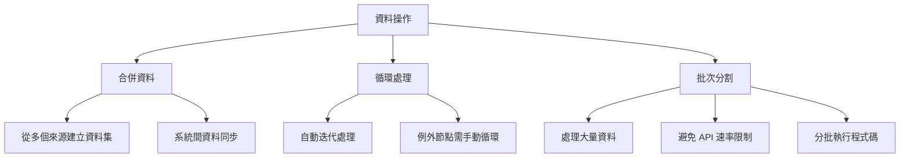
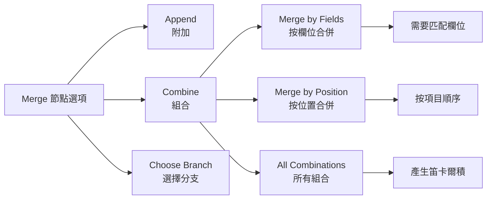
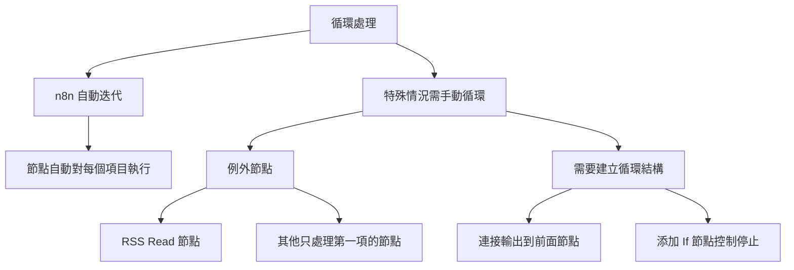

---
#https://www.notion.so/n8n/Frontmatter-432c2b8dff1f43d4b1c8d20075510fe4
contentType: tutorial
---

# 合併和分割資料

在本章中，您將學習如何合併和分割資料，以及在什麼情況下執行這些操作可能有用。



## 合併資料

在某些情況下，您可能需要合併（組合）並處理來自不同來源的資料。

合併資料可能涉及：

- 從多個來源建立一個資料集
- 在多個系統之間同步資料。這可能包括刪除重複資料或在一個系統中的資料更改時更新另一個系統中的資料

/// note | 單向 vs. 雙向同步
在單向同步中，資料在一個方向上同步。一個系統作為唯一的真實來源。當該主系統中的資訊更改時，它會自動在次要系統中更改；但如果次要系統中的資訊更改，這些更改不會反映在主系統中。

在雙向同步中，資料在兩個方向（兩個系統之間）同步。當任一系統中的資訊更改時，它會自動在另一個系統中更改。

[這篇部落格教學](https://blog.n8n.io/how-to-sync-data-between-two-systems/)解釋了如何在兩個 CRM 之間進行單向和雙向資料同步。
///



在 n8n 中，您可以使用 [Merge 節點](/integrations/builtin/core-nodes/n8n-nodes-base.merge.md){:target="_blank"} 合併來自兩個不同節點的資料，該節點提供多個合併選項：

- [Append](/integrations/builtin/core-nodes/n8n-nodes-base.merge.md#append){:target="_blank"}
- [Combine](/integrations/builtin/core-nodes/n8n-nodes-base.merge.md#combine){:target="_blank"}
	- [Merge by Fields](/integrations/builtin/core-nodes/n8n-nodes-base.merge.md#combine-by-matching-fields){:target="_blank"}：需要輸入欄位進行匹配
	- [Merge by Position](/integrations/builtin/core-nodes/n8n-nodes-base.merge.md#combine-by-position){:target="_blank"}
	- [Combine all possible combinations](/integrations/builtin/core-nodes/n8n-nodes-base.merge.md#combine-by-all-possible-combinations){:target="_blank"}
- [Choose Branch](/integrations/builtin/core-nodes/n8n-nodes-base.merge.md#choose-branch){:target="_blank"}

請注意，Combine > Merge by Fields 需要您輸入要匹配的輸入欄位。這些欄位應該在資料來源之間包含相同的值，以便 n8n 可以正確地將資料匹配在一起。在 **Merge 節點**中，它們稱為 `Input 1 Field` 和 `Input 2 Field`。

<figure><figcaption align = "center"><i>Merge 節點中的屬性輸入欄位</i></figcaption></figure>

/// warning | 點表示法的屬性輸入
如果您想在 **Merge 節點**參數 `Input 1 Field` 和 `Input 2 Field` 中引用巢狀值，您需要以點表示法格式輸入屬性鍵（作為文字，而不是表達式）。
///

/// note
如果您熟悉 SQL 連接，您也可以在別名 Join 下找到 **Merge 節點**。這可能更直觀。
///

### 合併練習

建立一個合併來自客戶資料儲存節點和 Code 節點的資料的工作流程。

1. 添加一個 **Merge 節點**，從 **Customer Datastore 節點**取得 `Input 1`，從 **Code 節點**取得 `Input 2`。
2. 在 **Customer Datastore 節點**中，執行 **Get All People** 操作。
3. 在 **Code 節點**中，建立一個包含兩個物件的陣列，每個物件有三個屬性：`name`、`language` 和 `country`，其中屬性 `country` 有兩個子屬性 `code` 和 `name`。
	- 使用來自客戶資料庫的兩個角色的資訊填寫這些屬性的值。
	- 例如，Jay Gatsby 的語言是英語，國家名稱是美國。
4. 在 **Merge 節點**中，嘗試不同的合併選項。

??? note "顯示解答"

	此練習的工作流程如下所示：

	<figure><figcaption align = "center"><i>合併資料的工作流程練習</i></figcaption></figure>

	如果您使用 **Keep Matches** 選項合併資料，使用名稱作為要匹配的輸入欄位，結果應該如下所示（注意此範例只包含 Jay Gatsby；根據您選擇的角色，您的結果可能看起來不同）：

	<figure><figcaption align = "center"><i>使用保留匹配選項的 Merge 節點輸出</i></figcaption></figure>

	要檢查節點的配置，您可以複製下面的 JSON 工作流程程式碼並將其貼到您的編輯器 UI 中：

	```json
	{
	"meta": {
		"templateCredsSetupCompleted": true,
		"instanceId": "cb484ba7b742928a2048bf8829668bed5b5ad9787579adea888f05980292a4a7"
	},
	"nodes": [
		{
		"parameters": {
			"mode": "combine",
			"mergeByFields": {
			"values": [
				{
				"field1": "name",
				"field2": "name"
				}
			]
			},
			"options": {}
		},
		"id": "578365f3-26dd-4fa6-9858-f0a5fdfc413b",
		"name": "Merge",
		"type": "n8n-nodes-base.merge",
		"typeVersion": 2.1,
		"position": [
			720,
			580
		]
		},
		{
		"parameters": {},
		"id": "71aa5aad-afdf-4f8a-bca0-34450eee8acc",
		"name": "When clicking \"Execute workflow\"",
		"type": "n8n-nodes-base.manualTrigger",
		"typeVersion": 1,
		"position": [
			260,
			560
		]
		},
		{
		"parameters": {
			"operation": "getAllPeople"
		},
		"id": "497174fe-3cab-4160-8103-78b44efd038d",
		"name": "Customer Datastore (n8n training)",
		"type": "n8n-nodes-base.n8nTrainingCustomerDatastore",
		"typeVersion": 1,
		"position": [
			500,
			460
		]
		},
		{
		"parameters": {
			"jsCode": "return [\n  {\n    'name': 'Jay Gatsby',\n    'language': 'English',\n    'country': {\n      'code': 'US',\n      'name': 'United States'\n    }\n    \n  }\n  \n];"
		},
		"id": "387e8a1e-e796-4f05-8e75-7ce25c786c5f",
		"name": "Code",
		"type": "n8n-nodes-base.code",
		"typeVersion": 2,
		"position": [
			500,
			720
		]
		}
	],
	"connections": {
		"When clicking \"Execute workflow\"": {
		"main": [
			[
			{
				"node": "Customer Datastore (n8n training)",
				"type": "main",
				"index": 0
			},
			{
				"node": "Code",
				"type": "main",
				"index": 0
			}
			]
		]
		},
		"Customer Datastore (n8n training)": {
		"main": [
			[
			{
				"node": "Merge",
				"type": "main",
				"index": 0
			}
			]
		]
		},
		"Code": {
		"main": [
			[
			{
				"node": "Merge",
				"type": "main",
				"index": 1
			}
			]
		]
		}
	},
	"pinData": {}
	}
	```

## 循環



在某些情況下，您可能需要對陣列的每個元素或每個資料項目執行相同的操作（例如向地址簿中的每個聯絡人發送訊息）。在技術術語中，您需要迭代資料（使用循環）。

n8n 通常會自動處理這種重複處理，因為節點會為每個項目執行一次，因此您不需要在工作流程中建立循環。

但是，有一些[節點和操作的例外](/flow-logic/looping.md#node-exceptions){:target="_blank"}需要您在工作流程中建立循環。

要[在 n8n 工作流程中建立循環](/flow-logic/looping.md#using-loops-in-n8n){:target="_blank"}，您需要將一個節點的輸出連接到前一個節點的輸入，並添加一個 **If 節點**來檢查何時停止循環。

## 批次分割資料

如果您需要處理大量傳入資料、多次執行 **Code 節點**或避免 API 速率限制，最好將資料分割成批次（群組）並處理這些批次。

對於這些處理，請使用 [**Loop Over Items 節點**](/integrations/builtin/core-nodes/n8n-nodes-base.splitinbatches.md){:target="_blank"}。此節點將輸入資料分割成指定的批次大小，並在每次迭代中返回預定義數量的資料。

/// warning | Loop Over Items 節點的執行
**Loop Over Items 節點**在所有傳入的項目被分成批次並傳遞給工作流程中的下一個節點後停止執行，因此不需要添加 **If 節點**來停止循環。
///

### 循環/批次練習

建立一個從 Medium 和 dev.to 讀取 RSS 饋送的工作流程。工作流程應包含三個節點：

1. 一個 **Code 節點**，返回 Medium (`https://medium.com/feed/n8n-io`) 和 dev.to (`https://dev.to/feed/n8n`) 的 RSS 饋送 URL。
2. 一個 **Loop Over Items 節點**，`Batch Size: 1`，接收來自 **Code 節點**和 **RSS Read 節點**的輸入並迭代項目。
3. 一個 **RSS Read 節點**，獲取 Medium RSS 饋送的 URL，作為表達式傳遞：`{{ $json.url }}`。
	- **RSS Read 節點**是[例外節點](/flow-logic/looping.md#node-exceptions){:target="_blank"}之一，它只處理接收到的第一個項目，因此需要 **Loop Over Items 節點**來迭代多個項目。

??? note "顯示解答"

	1. 添加一個 **Code 節點**。您可以用多種方式格式化程式碼，一種方式是：
		- 設定 **Mode** 為 `Run Once for All Items`。
		- 設定 **Language** 為 `JavaScript`。
		- 複製下面的程式碼並將其貼到 JavaScript Code 編輯器中：
			```javascript
			let urls = [
				{
					json: {
					url: 'https://medium.com/feed/n8n-io'
					}
				},
				{
				json: {
					url: 'https://dev.to/feed/n8n'
					} 
				}
			]
			return urls;
			```
	2. 添加一個連接到 **Code 節點**的 **Loop Over Items 節點**。
		- 設定 **Batch Size** 為 `1`。
	3. **Loop Over Items 節點**會自動添加一個名為"Replace Me"的節點。用 **RSS Read 節點**替換該節點。
		- 設定 **URL** 使用來自 Code 節點的 url：`{{ $json.url }}`。
	
	此練習的工作流程如下所示：

	<figure><figcaption align = "center"><i>從兩個部落格獲取 RSS 饋送的工作流程</i></figcaption></figure>

	要檢查節點的配置，您可以複製下面的 JSON 工作流程程式碼並將其貼到您的編輯器 UI 中：

	```json
	{
	"meta": {
		"templateCredsSetupCompleted": true,
		"instanceId": "cb484ba7b742928a2048bf8829668bed5b5ad9787579adea888f05980292a4a7"
	},
	"nodes": [
		{
		"parameters": {},
		"id": "ed8dc090-ae8c-4db6-a93b-0fa873015c25",
		"name": "When clicking \"Execute workflow\"",
		"type": "n8n-nodes-base.manualTrigger",
		"typeVersion": 1,
		"position": [
			460,
			460
		]
		},
		{
		"parameters": {
			"jsCode": "let urls = [\n  {\n    json: {\n      url: 'https://medium.com/feed/n8n-io'\n    }\n  },\n  {\n   json: {\n     url: 'https://dev.to/feed/n8n'\n   } \n  }\n]\n\nreturn urls;"
		},
		"id": "1df2a9bf-f970-4e04-b906-92dbbc9e8d3a",
		"name": "Code",
		"type": "n8n-nodes-base.code",
		"typeVersion": 2,
		"position": [
			680,
			460
		]
		},
		{
		"parameters": {
			"options": {}
		},
		"id": "3cce249a-0eab-42e2-90e3-dbdf3684e012",
		"name": "Loop Over Items",
		"type": "n8n-nodes-base.splitInBatches",
		"typeVersion": 3,
		"position": [
			900,
			460
		]
		},
		{
		"parameters": {
			"url": "={{ $json.url }}",
			"options": {}
		},
		"id": "50e1c1dc-9a5d-42d3-b7c0-accc31636aa6",
		"name": "RSS Read",
		"type": "n8n-nodes-base.rssFeedRead",
		"typeVersion": 1,
		"position": [
			1120,
			460
		]
		}
	],
	"connections": {
		"When clicking \"Execute workflow\"": {
		"main": [
			[
			{
				"node": "Code",
				"type": "main",
				"index": 0
			}
			]
		]
		},
		"Code": {
		"main": [
			[
			{
				"node": "Loop Over Items",
				"type": "main",
				"index": 0
			}
			]
		]
		},
		"Loop Over Items": {
		"main": [
			null,
			[
			{
				"node": "RSS Read",
				"type": "main",
				"index": 0
			}
			]
		]
		},
		"RSS Read": {
		"main": [
			[
			{
				"node": "Loop Over Items",
				"type": "main",
				"index": 0
			}
			]
		]
		}
	},
	"pinData": {}
	}
	```