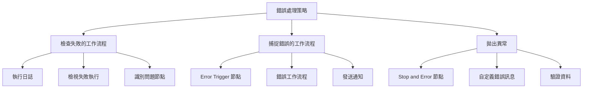
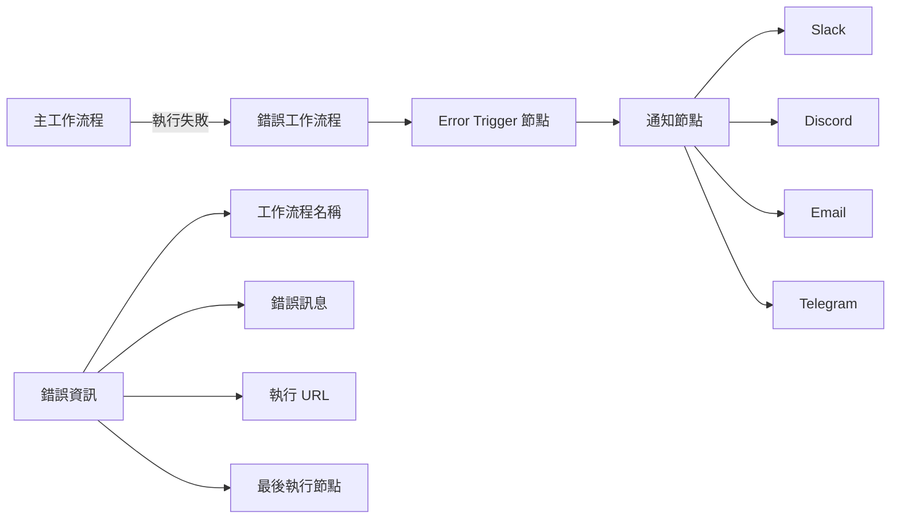
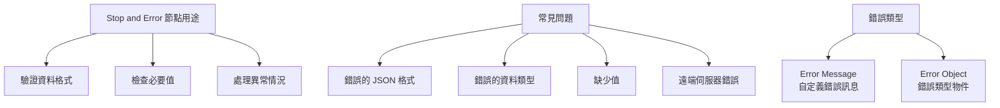

---
#https://www.notion.so/n8n/Frontmatter-432c2b8dff1f43d4b1c8d20075510fe4
contentType: tutorial
---

# 處理工作流程中的錯誤

有時您建立了一個很好的工作流程，但在嘗試執行時失敗了。工作流程執行可能因各種原因失敗，從節點配置錯誤或第三方服務故障等直接問題到更神秘的錯誤。

但不要驚慌。在本課中，您將學習如何排除錯誤，以便盡快讓您的工作流程正常運行。



## 檢查失敗的工作流程

n8n 會追蹤您的工作流程執行。

當您的工作流程之一失敗時，您可以檢查執行日誌以查看出了什麼問題。執行日誌顯示您已儲存工作流程的最新執行時間、狀態、模式和執行時間列表。

通過在左側面板中選擇[**執行**](/workflows/executions/index.md#execution-modes)來開啟執行日誌。

要調查列表中的特定失敗執行，請選擇名稱或將滑鼠懸停在相應執行的行上時出現的**檢視**按鈕。

<figure><figcaption align = "center"><i>執行日誌</i></figcaption></figure>

這將以唯讀模式開啟工作流程，您可以在其中查看每個節點的執行情況。這種表示可以幫助您識別工作流程在哪個點遇到問題。

要在檢視執行和編輯器之間切換，請選擇頁面頂部的**編輯器 | 執行**按鈕。

<figure><figcaption align = "center"><i>工作流程執行檢視</i></figcaption></figure>

## 捕捉錯誤的工作流程



要捕捉失敗的工作流程，請使用 [**Error Trigger 節點**](/integrations/builtin/core-nodes/n8n-nodes-base.errortrigger.md)建立一個單獨的[**錯誤工作流程**](/flow-logic/error-handling.md)。只有在主工作流程執行失敗時，此工作流程才會執行。

在您的**錯誤工作流程**中使用其他有意義的節點，例如使用電子郵件或 Slack 發送有關失敗工作流程及其錯誤的通知。

要接收失敗工作流程的錯誤訊息，請在[工作流程設定](/workflows/settings.md)中將**錯誤工作流程**設定為使用 **Error Trigger 節點**的錯誤工作流程。

常規工作流程和錯誤工作流程之間的唯一區別是後者包含 **Error Trigger 節點**。確保在將其設定為另一個工作流程的指定錯誤工作流程之前建立此節點。

/// note | 錯誤工作流程
- 如果工作流程使用 Error Trigger 節點，您不必啟動工作流程。
- 如果工作流程包含 Error Trigger 節點，預設情況下，工作流程將自己用作錯誤工作流程。
- 手動執行工作流程時無法測試錯誤工作流程。Error trigger 僅在自動工作流程錯誤時執行。
- 您可以為多個工作流程設定相同的錯誤工作流程。
///

### 練習

在前面的章節中，您已經建立了幾個小型工作流程。現在，選擇其中一個您想要監控的工作流程，並為其建立一個錯誤工作流程：

1. 建立一個新的錯誤工作流程。
2. 添加 **Error Trigger 節點**。
3. 將您選擇的通訊平台節點連接到 Error Trigger 節點，例如 [Slack](/integrations/builtin/app-nodes/n8n-nodes-base.slack.md)、[Discord](/integrations/builtin/app-nodes/n8n-nodes-base.discord/index.md)、[Telegram](/integrations/builtin/app-nodes/n8n-nodes-base.telegram/index.md)，甚至 [Gmail](/integrations/builtin/app-nodes/n8n-nodes-base.gmail/index.md) 或更通用的 [Send Email](/integrations/builtin/core-nodes/n8n-nodes-base.sendemail.md)。
4. 在您要監控的工作流程中，開啟[工作流程設定](/workflows/settings.md)並選擇您剛剛建立的新錯誤工作流程。請注意，此工作流程需要自動執行才能觸發錯誤工作流程。

??? note "顯示解答"

	此練習的工作流程如下所示：

	<figure><figcaption align = "center"><i>錯誤工作流程</i></figcaption></figure>

	要檢查節點的配置，您可以複製下面的 JSON 工作流程程式碼並將其貼到您的編輯器 UI 中：

	```json
	{
		"nodes": [
			{
				"parameters": {},
				"name": "Error Trigger",
				"type": "n8n-nodes-base.errorTrigger",
				"typeVersion": 1,
				"position": [
					720,
					-380
				]
			},
			{
				"parameters": {
					"channel": "channelname",
					"text": "=This workflow {{$node[\"Error Trigger\"].json[\"workflow\"][\"name\"]}}failed.\nHave a look at it here: {{$node[\"Error Trigger\"].json[\"execution\"][\"url\"]}}",
					"attachments": [],
					"otherOptions": {}
				},
				"name": "Slack",
				"type": "n8n-nodes-base.slack",
				"position": [
					900,
					-380
				],
				"typeVersion": 1,
				"credentials": {
					"slackApi": {
						"id": "17",
						"name": "slack_credentials"
					}
				}
			}
		],
		"connections": {
			"Error Trigger": {
				"main": [
					[
						{
							"node": "Slack",
							"type": "main",
							"index": 0
						}
					]
				]
			}
		}
	}
	```

## 拋出工作流程中的異常



另一種排除工作流程錯誤的方法是在工作流程中包含 [**Stop and Error 節點**](/integrations/builtin/core-nodes/n8n-nodes-base.stopanderror.md)。此節點會拋出錯誤。您可以指定錯誤類型：

- **Error Message**：返回有關錯誤的自定義訊息
- **Error Object**：返回錯誤類型

您只能將 **Stop and Error 節點**用作工作流程中的最後一個節點。

/// note | 何時拋出錯誤
使用 **Stop and Error 節點**拋出異常對於驗證來自節點的資料（或關於資料的假設）並返回自定義錯誤訊息很有用。

如果您正在處理來自第三方服務的資料，您可能會遇到以下問題：

- 錯誤格式的 JSON 輸出
- 具有錯誤類型的資料（例如，具有非數字值的數字資料）
- 缺少值
- 來自遠端伺服器的錯誤

雖然這種無效資料可能不會立即導致工作流程失敗，但它可能會在以後造成問題，然後就很難追蹤源錯誤。這就是為什麼最好在您知道可能存在問題時拋出錯誤。

<figure><figcaption align = "center"><i>帶有錯誤訊息的 Stop and Error 節點</i></figcaption></figure>
///