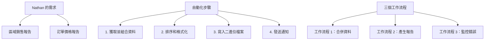

---
#https://www.notion.so/n8n/Frontmatter-432c2b8dff1f43d4b1c8d20075510fe4
contentType: tutorial
---

# 自動化商業工作流程

還記得[我們的朋友 Nathan](/courses/level-one/chapter-3.md)嗎？

**Nathan 🙋：** 您好，又是我。我的經理對我的第一個工作流程自動化解決方案印象深刻，因此她委託我承擔更多責任。 
**您 👩‍🔧：** 更多工作和責任。恭喜，我想是吧。您現在需要做什麼？ 
**Nathan 🙋：** 我獲得了所有銷售資料的存取權限，現在負責建立兩份報告：一份是區域銷售報告，另一份是訂單價格報告。它們基於來自不同來源的資料，並以不同的格式呈現。 
**您 👩‍🔧：** 聽起來像是很多手動工作，但這種工作可以自動化。讓我們開始吧！

## 工作流程設計

現在我們知道 Nathan 想要自動化什麼，讓我們列出他需要採取的步驟來實現這個目標：

1. 從所有必要來源獲取並組合資料。
2. 對資料進行排序並格式化日期。
3. 寫入二進位檔案。
4. 使用電子郵件和 Discord 發送通知。

n8n 為所有這些步驟提供[核心節點](/integrations/builtin/node-types.md#core-nodes)。這個用例有些複雜。我們應該從三個單獨的工作流程來建立它：

1. 一個將公司資料與外部資訊合併的工作流程。
2. 一個產生報告的工作流程。
3. 一個監控第二個工作流程錯誤的工作流程。

## 工作流程前提條件

要建立這些工作流程，您需要以下內容：

* 一個 [Airtable](https://airtable.com/){:target="_blank" .external-link} 帳戶和[憑證](/integrations/builtin/credentials/airtable.md)。
* 一個 [Google](https://www.google.com/account/about/){:target="_blank" .external-link} 帳戶和[憑證](/integrations/builtin/credentials/google/index.md)以存取 Gmail。
* 一個 [Discord](https://discord.com/){:target="_blank" .external-link} 帳戶和 webhook URL（當您註冊本課程時，您會通過電子郵件收到此內容）。

接下來，您將按照逐步說明建立這三個工作流程。