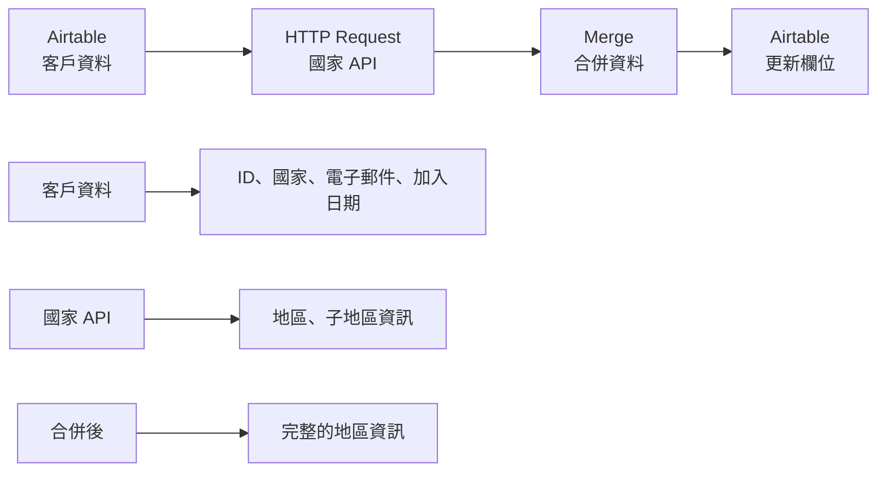

---
#https://www.notion.so/n8n/Frontmatter-432c2b8dff1f43d4b1c8d20075510fe4
contentType: tutorial
---

# 工作流程 1：合併資料

Nathan 的公司將客戶資料儲存在 Airtable 中。這些資料包含有關客戶 ID、國家、電子郵件和加入日期的資訊，但缺少有關其各自地區和子地區的資料。您需要填寫這最後兩個欄位，以便建立區域銷售報告。

要完成此任務，您首先需要在您的 Airtable 帳戶中複製此表格：

<iframe class="airtable-embed" src="https://airtable.com/embed/shrNX9tjPkVLABbNz?backgroundColor=orange&viewControls=on" frameborder="0" onmousewheel="" width="100%" height="533" style="background: transparent; border: 1px solid #ccc;"></iframe>

接下來，建立一個小型工作流程，合併來自 Airtable 和 REST Countries API 的資料：

1. 使用 [**Airtable 節點**](/integrations/builtin/app-nodes/n8n-nodes-base.airtable/index.md)列出名為 `customers` 的 Airtable 表格中的資料。
2. 使用 [**HTTP Request 節點**](/integrations/builtin/core-nodes/n8n-nodes-base.httprequest/index.md)從 REST Countries API 獲取資料：`https://restcountries.com/v3.1/all`，並發送查詢參數名稱 `fields`，值為 `name,region,subregion`。這將返回有關世界各國的資料，分割成單獨的項目。
3. 使用 [**Merge 節點**](/integrations/builtin/core-nodes/n8n-nodes-base.merge.md)按國家名稱合併來自 Airtable 和 Countries API 的資料，分別表示為 Airtable 中的 `customerCountry` 和 Countries API 中的 `name.common`。
4. 使用另一個 Airtable 節點更新 Airtable 中的 `region` 和 `subregion` 欄位，使用來自 Countries API 的資料。

工作流程應該如下所示：

<figure><figcaption align = "center"><i>合併來自 Airtable 和 Countries API 資料的工作流程 1</i></figcaption></figure>

/// question | 測驗問題
* **HTTP Request 節點**返回多少個項目？
* **Merge 節點**返回多少個項目？
* 在客戶表中分配了多少個唯一地區？
* 分配給 customerID 10 的子地區是什麼？
///