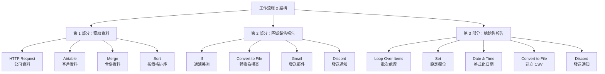

---
#https://www.notion.so/n8n/Frontmatter-432c2b8dff1f43d4b1c8d20075510fe4
contentType: tutorial
---

# 工作流程 2：產生報告

在此工作流程中，您將合併來自不同來源的資料、轉換二進位資料、產生檔案並發送相關通知。最終的工作流程應該如下所示：

<figure><figcaption align = "center"><i>聚合資料和產生檔案的工作流程 2</i></figcaption></figure>

為了讓事情更容易，讓我們將工作流程分成三個部分。



## 第 1 部分：從不同來源獲取資料

工作流程的第一部分包含五個節點：

<figure><figcaption align = "center"><i>工作流程 1：從不同來源獲取資料</i></figcaption></figure>

1. 使用 [**HTTP Request 節點**](/integrations/builtin/core-nodes/n8n-nodes-base.httprequest/index.md)從儲存公司資料的 API 端點獲取資料。配置以下節點參數：

    - **Method**：Get
    - **URL**：您註冊本課程時在電子郵件中收到的**資料集 URL**。
    - **Authentication**：Generic Credential Type
        - **Generic Auth Type**：Header Auth
        - **Credentials for Header Auth**：您註冊本課程時在電子郵件中收到的 Header Auth 名稱和 Header Auth 值。
    - **Send Headers**：切換為 true
        - **Specify Headers**：選擇 `Using Fields Below`
        - **Name**：`unique_id`
        - **Value**：您註冊本課程時在電子郵件中收到的唯一 ID。

2. 使用 [**Airtable 節點**](/integrations/builtin/app-nodes/n8n-nodes-base.airtable/index.md)從 `customers` 表格（您更新了 `region` 和 `subregion` 欄位的地方）列出資料。
3. 使用 [**Merge 節點**](/integrations/builtin/core-nodes/n8n-nodes-base.merge.md)基於匹配 `customerID` 的輸入欄位合併來自 Airtable 和 HTTP Request 節點的資料。
4. 使用 [**Sort 節點**](/integrations/builtin/core-nodes/n8n-nodes-base.sort.md)按 `orderPrice` 降序排序資料。

/// question | 測驗問題
* 分配給客戶 1 的員工姓名是什麼？
* 客戶 2 的訂單狀態是什麼？
* 最高的訂單價格是多少？
///

## 第 2 部分：產生區域銷售檔案

工作流程的第二部分包含四個節點：

<figure><figcaption align = "center"><i>工作流程 2：產生區域銷售檔案</i></figcaption></figure>

1. 使用 [**If 節點**](/integrations/builtin/core-nodes/n8n-nodes-base.if.md)過濾只顯示來自 `Americas` 地區的訂單。
2. 使用 [**Convert to File**](/integrations/builtin/core-nodes/n8n-nodes-base.converttofile.md)將傳入的資料從 JSON 轉換為二進位格式。將每個項目轉換為單獨的檔案。（加分項：如果您能找出如何基於 orderID 命名每個報告！）
3. 使用 [**Gmail 節點**](/integrations/builtin/app-nodes/n8n-nodes-base.gmail/index.md)（或其他電子郵件節點）使用電子郵件將檔案發送到您可以存取的地址。請注意，您需要添加帶有資料屬性的附件。
4. 使用 [**Discord 節點**](/integrations/builtin/app-nodes/n8n-nodes-base.discord/index.md)在 n8n Discord 頻道 `#course-level-two` 中發送訊息。在節點中，配置以下參數：
    * **Webhook URL**：您註冊本課程時在電子郵件中收到的 Discord URL。
    * **Text**："我使用帶有標籤 ID `{label ID}` 的電子郵件發送了檔案。我的 ID：" 後面跟著您註冊課程時通過電子郵件收到的唯一 ID。<br/> 請注意，您需要用引用節點資料的[表達式](/glossary.md#expression-n8n)替換大括號 `{}` 中的文字。

/// question | 測驗問題
* 有多少訂單分配給 `Americas` 地區？
* `Americas` 地區訂單的總價格是多少？
* **Write Binary File 節點**返回多少個項目？
///

## 第 3 部分：產生總銷售檔案

工作流程的第三部分包含五個節點：

<figure><figcaption align = "center"><i>工作流程 3：產生總銷售檔案</i></figcaption></figure>

1. 使用 [**Loop Over Items 節點**](/integrations/builtin/core-nodes/n8n-nodes-base.splitinbatches.md)將來自 Item Lists 節點的資料分割成 5 個批次。
2. 使用 [**Set 節點**](/integrations/builtin/core-nodes/n8n-nodes-base.set.md)設定四個值，從前一個節點引用表達式：`customerEmail`、`customerRegion`、`customerSince` 和 `orderPrice`。
3. 使用 [**Date & Time 節點**](/integrations/builtin/core-nodes/n8n-nodes-base.datetime.md)將欄位 `customerSince` 的日期格式更改為 MM/DD/YYYY 格式。
    - 設定 **Include Input Fields** 選項以保持所有資料在一起。
4. 使用 [**Convert to File 節點**](/integrations/builtin/core-nodes/n8n-nodes-base.converttofile.md)建立 CSV 試算表，檔案名稱設定為表達式：`{{$runIndex > 0 ? 'file_low_orders':'file_high_orders'}}`。
5. 使用 [**Discord 節點**](/integrations/builtin/app-nodes/n8n-nodes-base.discord/index.md)在 n8n Discord 頻道 `#course-level-two` 中發送訊息。在節點中，配置以下參數：
    * **Webhook URL**：您註冊本課程時在電子郵件中收到的 Discord URL。
    * **Text**："我建立了試算表 `{file name}`。我的 ID：" 後面跟著您註冊課程時通過電子郵件收到的唯一 ID。<br/> 請注意，您需要用引用前一個 **Convert to File 節點**資料的表達式替換 `{file name}`。<br/>

/// question | 測驗問題
* 第一批項目中最低的訂單價格是多少？
* 客戶 7 的格式化日期是什麼？
* **Convert to File 節點**返回多少個項目？
///

??? note "顯示解答"

	要檢查節點的配置，您可以複製下面的 JSON 工作流程程式碼並將其貼到您的編輯器 UI 中：

	```json
    {
    "meta": {
        "templateCredsSetupCompleted": true,
        "instanceId": "cb484ba7b742928a2048bf8829668bed5b5ad9787579adea888f05980292a4a7"
    },
    "nodes": [
        {
        "parameters": {
            "sendTo": "bart@n8n.io",
            "subject": "Your TPS Reports",
            "emailType": "text",
            "message": "Please find your TPS report attached.",
            "options": {
            "attachmentsUi": {
                "attachmentsBinary": [
                {}
                ]
            }
            }
        },
        "id": "d889eb42-8b34-4718-b961-38c8e7839ea6",
        "name": "Gmail",
        "type": "n8n-nodes-base.gmail",
        "typeVersion": 2.1,
        "position": [
            2100,
            500
        ],
        "credentials": {
            "gmailOAuth2": {
            "id": "HFesCcFcn1NW81yu",
            "name": "Gmail account 7"
            }
        }
        },
        {
        "parameters": {},
        "id": "c0236456-40be-4f8f-a730-e56cb62b7b5c",
        "name": "When clicking \"Execute workflow\"",
        "type": "n8n-nodes-base.manualTrigger",
        "typeVersion": 1,
        "position": [
            780,
            600
        ]
        },
        {
        "parameters": {
            "url": "https://internal.users.n8n.cloud/webhook/level2-erp",
            "authentication": "genericCredentialType",
            "genericAuthType": "httpHeaderAuth",
            "sendHeaders": true,
            "headerParameters": {
            "parameters": [
                {
                "name": "unique_id",
                "value": "recFIcD6UlSyxaVMQ"
                }
            ]
            },
            "options": {}
        },
        "id": "cc106fa0-6630-4c84-aea4-a4c7a3c149e9",
        "name": "HTTP Request",
        "type": "n8n-nodes-base.httpRequest",
        "typeVersion": 4.1,
        "position": [
            1000,
            500
        ],
        "credentials": {
            "httpHeaderAuth": {
            "id": "qeHdJdqqqaTC69cm",
            "name": "Course L2 Credentials"
            }
        }
        },
        {
        "parameters": {
            "operation": "search",
            "base": {
            "__rl": true,
            "value": "apprtKkVasbQDbFa1",
            "mode": "list",
            "cachedResultName": "All your base",
            "cachedResultUrl": "https://airtable.com/apprtKkVasbQDbFa1"
            },
            "table": {
            "__rl": true,
            "value": "tblInZ7jeNdlUOvxZ",
            "mode": "list",
            "cachedResultName": "Course L2, Workflow 1",
            "cachedResultUrl": "https://airtable.com/apprtKkVasbQDbFa1/tblInZ7jeNdlUOvxZ"
            },
            "options": {}
        },
        "id": "e5ae1927-b531-401c-9cb2-ecf1f2836ba6",
        "name": "Airtable",
        "type": "n8n-nodes-base.airtable",
        "typeVersion": 2,
        "position": [
            1000,
            700
        ],
        "credentials": {
            "airtableTokenApi": {
            "id": "MIplo6lY3AEsdf7L",
            "name": "Airtable Personal Access Token account 4"
            }
        }
        },
        {
        "parameters": {
            "mode": "combine",
            "mergeByFields": {
            "values": [
                {
                "field1": "customerID",
                "field2": "customerID"
                }
            ]
            },
            "options": {}
        },
        "id": "1cddc984-7fca-45e0-83b8-0c502cb4c78c",
        "name": "Merge",
        "type": "n8n-nodes-base.merge",
        "typeVersion": 2.1,
        "position": [
            1220,
            600
        ]
        },
        {
        "parameters": {
            "sortFieldsUi": {
            "sortField": [
                {
                "fieldName": "orderPrice",
                "order": "descending"
                }
            ]
            },
            "options": {}
        },
        "id": "2f55af2e-f69b-4f61-a9e5-c7eefaad93ba",
        "name": "Sort",
        "type": "n8n-nodes-base.sort",
        "typeVersion": 1,
        "position": [
            1440,
            600
        ]
        },
        {
        "parameters": {
            "conditions": {
            "options": {
                "caseSensitive": true,
                "leftValue": "",
                "typeValidation": "strict"
            },
            "conditions": [
                {
                "id": "d3afe65c-7c80-4caa-9d1c-33c62fbc2197",
                "leftValue": "={{ $json.region }}",
                "rightValue": "Americas",
                "operator": {
                    "type": "string",
                    "operation": "equals",
                    "name": "filter.operator.equals"
                }
                }
            ],
            "combinator": "and"
            },
            "options": {}
        },
        "id": "2ed874a9-5bcf-4cc9-9b52-ea503a562892",
        "name": "If",
        "type": "n8n-nodes-base.if",
        "typeVersion": 2,
        "position": [
            1660,
            500
        ]
        },
        {
        "parameters": {
            "operation": "toJson",
            "mode": "each",
            "options": {
            "fileName": "=report_orderID_{{ $('If').item.json.orderID }}.json"
            }
        },
        "id": "d93b4429-2200-4a84-8505-16266fedfccd",
        "name": "Convert to File",
        "type": "n8n-nodes-base.convertToFile",
        "typeVersion": 1.1,
        "position": [
            1880,
            500
        ]
        },
        {
        "parameters": {
            "authentication": "webhook",
            "content": "I sent the file using email with the label ID  and wrote the binary file {file name}. My ID: 123",
            "options": {}
        },
        "id": "26f43f2c-1422-40de-9f40-dd2d80926b1c",
        "name": "Discord",
        "type": "n8n-nodes-base.discord",
        "typeVersion": 2,
        "position": [
            2320,
            500
        ],
        "credentials": {
            "discordWebhookApi": {
            "id": "WEBrtPdoLrhlDYKr",
            "name": "L2 Course Discord Webhook account"
            }
        }
        },
        {
        "parameters": {
            "batchSize": 5,
            "options": {}
        },
        "id": "0fa1fbf6-fe77-4044-a445-c49a1db37dec",
        "name": "Loop Over Items",
        "type": "n8n-nodes-base.splitInBatches",
        "typeVersion": 3,
        "position": [
            1660,
            700
        ]
        },
        {
        "parameters": {
            "assignments": {
            "assignments": [
                {
                "id": "ce839b80-c50d-48f5-9a24-bb2df6fdd2ff",
                "name": "customerEmail",
                "value": "={{ $json.customerEmail }}",
                "type": "string"
                },
                {
                "id": "0c613366-3808-45a2-89cc-b34c7b9f3fb7",
                "name": "region",
                "value": "={{ $json.region }}",
                "type": "string"
                },
                {
                "id": "0f19a88c-deb0-4119-8965-06ed62a840b2",
                "name": "customerSince",
                "value": "={{ $json.customerSince }}",
                "type": "string"
                },
                {
                "id": "a7e890d6-86af-4839-b5df-d2a4efe923f7",
                "name": "orderPrice",
                "value": "={{ $json.orderPrice }}",
                "type": "number"
                }
            ]
            },
            "options": {}
        },
        "id": "09b8584c-4ead-4007-a6cd-edaa4669a757",
        "name": "Edit Fields",
        "type": "n8n-nodes-base.set",
        "typeVersion": 3.3,
        "position": [
            1880,
            700
        ]
        },
        {
        "parameters": {
            "operation": "formatDate",
            "date": "={{ $json.customerSince }}",
            "options": {
            "includeInputFields": true
            }
        },
        "id": "c96fae90-e080-48dd-9bff-3e4506aafb86",
        "name": "Date & Time",
        "type": "n8n-nodes-base.dateTime",
        "typeVersion": 2,
        "position": [
            2100,
            700
        ]
        },
        {
        "parameters": {
            "options": {
            "fileName": "={{$runIndex > 0 ? 'file_low_orders':'file_high_orders'}}"
            }
        },
        "id": "43dc8634-2f16-442b-a754-89f47c51c591",
        "name": "Convert to File1",
        "type": "n8n-nodes-base.convertToFile",
        "typeVersion": 1.1,
        "position": [
            2320,
            700
        ]
        },
        {
        "parameters": {
            "authentication": "webhook",
            "content": "I created the spreadsheet {file name}. My ID: 123",
            "options": {}
        },
        "id": "05da1c22-d1f6-4ea6-9102-f74f9ae2e9d3",
        "name": "Discord1",
        "type": "n8n-nodes-base.discord",
        "typeVersion": 2,
        "position": [
            2540,
            700
        ],
        "credentials": {
            "discordWebhookApi": {
            "id": "WEBrtPdoLrhlDYKr",
            "name": "L2 Course Discord Webhook account"
            }
        }
        }
    ],
    "connections": {
        "Gmail": {
        "main": [
            [
            {
                "node": "Discord",
                "type": "main",
                "index": 0
            }
            ]
        ]
        },
        "When clicking \"Execute workflow\"": {
        "main": [
            [
            {
                "node": "HTTP Request",
                "type": "main",
                "index": 0
            },
            {
                "node": "Airtable",
                "type": "main",
                "index": 0
            }
            ]
        ]
        },
        "HTTP Request": {
        "main": [
            [
            {
                "node": "Merge",
                "type": "main",
                "index": 0
            }
            ]
        ]
        },
        "Airtable": {
        "main": [
            [
            {
                "node": "Merge",
                "type": "main",
                "index": 1
            }
            ]
        ]
        },
        "Merge": {
        "main": [
            [
            {
                "node": "Sort",
                "type": "main",
                "index": 0
            }
            ]
        ]
        },
        "Sort": {
        "main": [
            [
            {
                "node": "Loop Over Items",
                "type": "main",
                "index": 0
            },
            {
                "node": "If",
                "type": "main",
                "index": 0
            }
            ]
        ]
        },
        "If": {
        "main": [
            [
            {
                "node": "Convert to File",
                "type": "main",
                "index": 0
            }
            ]
        ]
        },
        "Convert to File": {
        "main": [
            [
            {
                "node": "Gmail",
                "type": "main",
                "index": 0
            }
            ]
        ]
        },
        "Loop Over Items": {
        "main": [
            null,
            [
            {
                "node": "Edit Fields",
                "type": "main",
                "index": 0
            }
            ]
        ]
        },
        "Edit Fields": {
        "main": [
            [
            {
                "node": "Date & Time",
                "type": "main",
                "index": 0
            }
            ]
        ]
        },
        "Date & Time": {
        "main": [
            [
            {
                "node": "Convert to File1",
                "type": "main",
                "index": 0
            }
            ]
        ]
        },
        "Convert to File1": {
        "main": [
            [
            {
                "node": "Discord1",
                "type": "main",
                "index": 0
            }
            ]
        ]
        },
        "Discord1": {
        "main": [
            [
            {
                "node": "Loop Over Items",
                "type": "main",
                "index": 0
            }
            ]
        ]
        }
    },
    "pinData": {}
    }
    ```