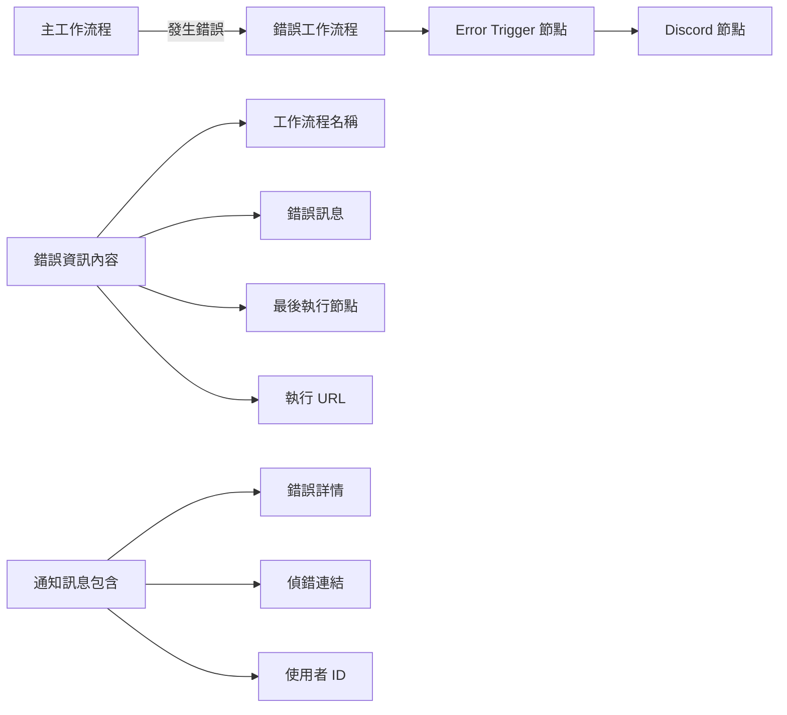

---
#https://www.notion.so/n8n/Frontmatter-432c2b8dff1f43d4b1c8d20075510fe4
contentType: tutorial
---

# 工作流程 3：監控工作流程錯誤

最後但同樣重要的是，讓我們幫助 Nathan 知道執行工作流程時是否有任何錯誤。

要完成此任務，請建立一個監控主工作流程的錯誤工作流程：

1. 建立一個新的工作流程。
2. 添加一個 **Error Trigger 節點**（並作為測試執行它）。
3. 將 **Discord 節點**連接到 **Error Trigger 節點**並配置這些欄位： 

	* **Webhook URL**：您註冊本課程時從 n8n 收到的電子郵件中的 Discord URL。
	* **Text**："工作流程 `{workflow name}` 失敗，錯誤訊息為：`{execution error message}`。最後執行的節點：`{name of the last executed node}`。在此檢查此工作流程執行：`{execution URL}` 我的唯一 ID：" 後面跟著您註冊課程時通過電子郵件收到的唯一 ID。

		請注意，您需要用從 Error Trigger 節點獲取相應資訊的表達式替換大括號 `{}` 中的文字。 

4. 執行 Discord 節點。
5. 將新建立的工作流程設定為您在上一課中建立的主工作流程的**錯誤工作流程**。

工作流程應該如下所示：

<figure><figcaption align = "center"><i>監控工作流程錯誤的工作流程 3</i></figcaption></figure>

/// question | 測驗問題
* **Error Trigger 節點**返回哪些欄位？
* **Error Trigger 節點**返回有關執行的什麼資訊？
* **Error Trigger 節點**返回有關工作流程的什麼資訊？
* 引用工作流程名稱的表達式是什麼？
///