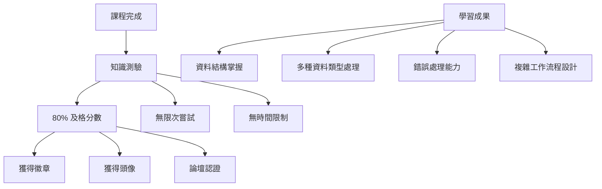
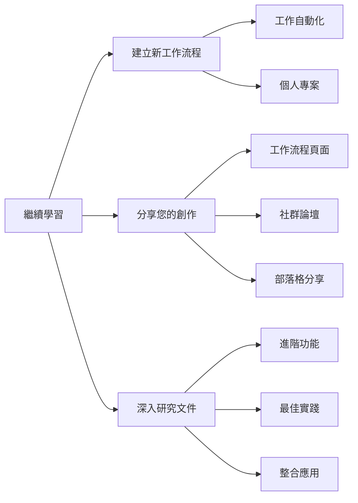

---
#https://www.notion.so/n8n/Frontmatter-432c2b8dff1f43d4b1c8d20075510fe4
contentType: tutorial
---

# 測試您的知識

恭喜，您完成了 n8n 第二級課程！

您已經學到了很多關於工作流程自動化的知識，並建立了相當複雜的業務工作流程。為什麼不展示您的技能呢？

您可以通過參加**測驗**來測試您的知識，測驗包含有關本課程中涵蓋的理論概念和工作流程的問題。

- 您需要至少有 80% 的正確答案才能通過測驗。
- 您可以無限次參加測驗。
- 回答測驗問題沒有時間限制。

 
[參加測驗！](https://n8n-community.typeform.com/to/r9hDbytg){ .md-button }

## 接下來做什麼？

- 為您的工作或個人用途建立新的工作流程並與我們分享。沒有想法嗎？在[工作流程頁面](https://n8n.io/workflows){:target="_blank" .external-link}和我們的[部落格](https://n8n.io/blog/){:target="_blank" .external-link}上尋找靈感。
- 通過閱讀[文件](/index.md)深入了解 n8n 的功能。