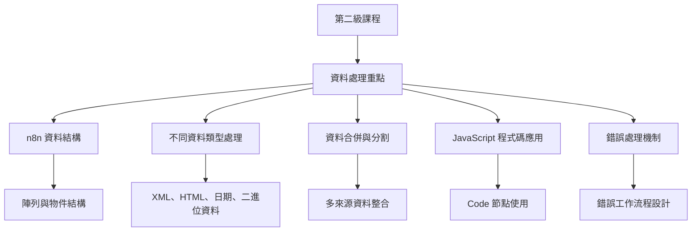
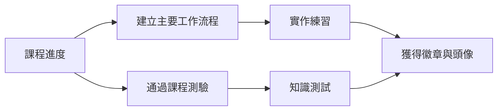

---
#https://www.notion.so/n8n/Frontmatter-432c2b8dff1f43d4b1c8d20075510fe4
contentType: overview
---

# 第二級課程：簡介

歡迎來到 **n8n 第二級課程**！

## 這個課程適合我嗎？

如果您符合以下條件，這個課程就是為您準備的：

- 想要自動化較為複雜的業務流程
- 想在完成[第一級課程](/courses/level-one/index.md)後深入了解 n8n

## 課程學習架構

## 我將在這個課程中學到什麼？

本課程的重點是資料處理。您將學習如何：

- 正確使用 n8n 的資料結構
- 處理不同的資料類型（例如 XML、HTML、日期、時間和二進位資料）
- 合併來自不同來源的資料（例如資料庫、試算表或 CRM）
- 在 [Code 節點](/integrations/builtin/core-nodes/n8n-nodes-base.code/index.md)中使用函數和 JavaScript 程式碼
- 處理錯誤工作流程和工作流程錯誤

您將通過在理論說明後完成簡短的實作練習，並按照指示建立業務工作流程來學習所有這些內容。

## 開始前需要準備什麼？

要以舒適的步調學習本課程，您需要以下準備：

- **n8n 設定**：您可以使用[自架版本](/hosting/installation/npm.md)或 [n8n Cloud](/manage-cloud/overview.md)
- **使用者 ID**：[在此註冊](https://n8n-community.typeform.com/to/HQoQ7nXg){:target="_blank" .external-link}以獲得您的唯一 ID 和課程中需要的其他憑證
- **基本 n8n 技能**：我們強烈建議在學習本課程之前先完成[第一級課程](/courses/level-one/index.md)
- **基本 JavaScript 理解**

## 課程需要多長時間？

完成課程大約需要**兩小時**。您不必一次完成全部內容；請隨時休息，準備好後再繼續。

## 如何完成課程？

本課程有兩個里程碑來測試您對所學內容的掌握程度：

- [x] 建立[主要工作流程](/courses/level-two/chapter-5/chapter-5.0.md)
- [x] 通過課程結束時的[測驗](https://n8n-community.typeform.com/to/r9hDbytg){:target="_blank" .external}

您可以隨時輸入您的唯一 ID [在此](https://internal.users.n8n.cloud/webhook/course-level-2/verify){:target="_blank" .external-link}**檢查您的進度**。

如果您成功完成上述里程碑，您將在論壇個人資料中獲得[**徽章和頭像**](https://community.n8n.io/badges/105/completed-n8n-course-level-2){:target="_blank" .external}。然後您可以分享您的個人資料和課程驗證 ID，向其他人展示您的 n8n 技能。

[讓我們開始吧！](/courses/level-two/chapter-1.md){ .md-button }